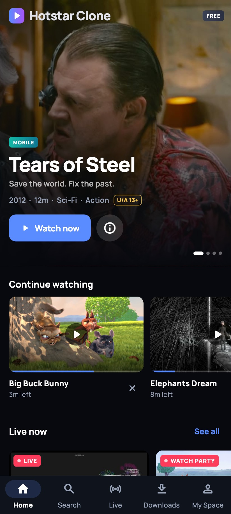
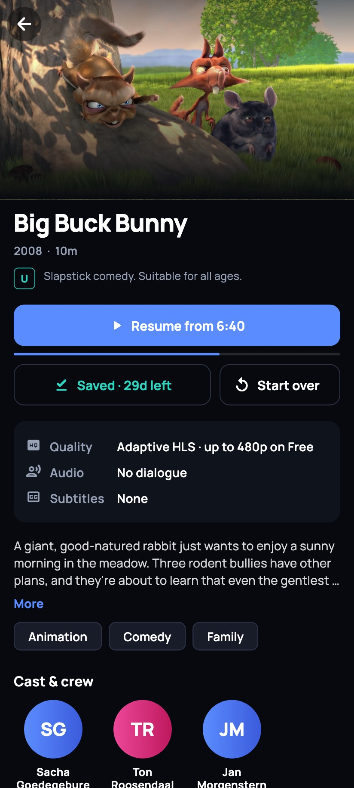
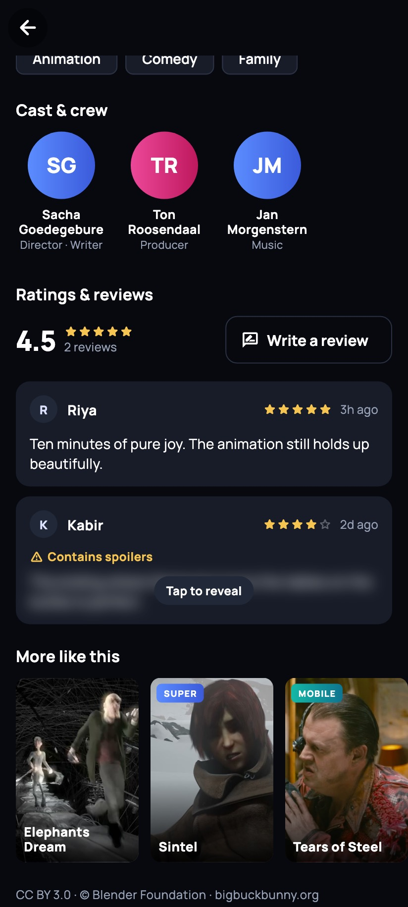
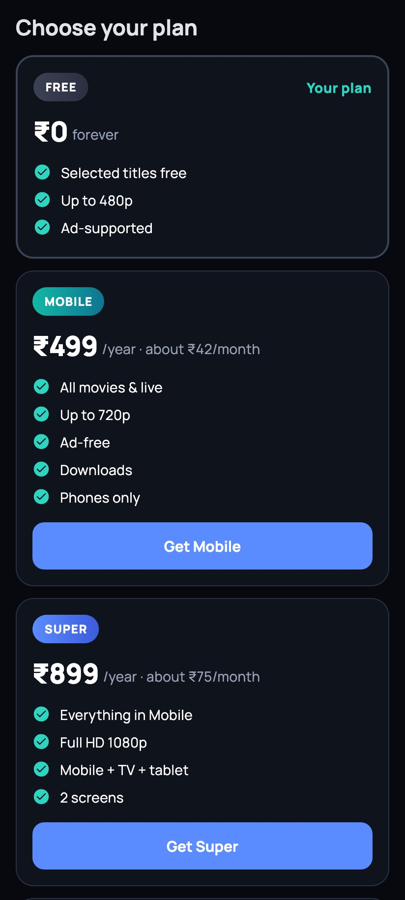
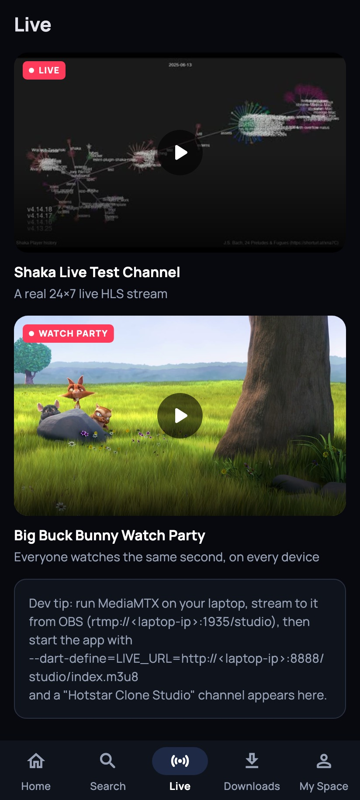
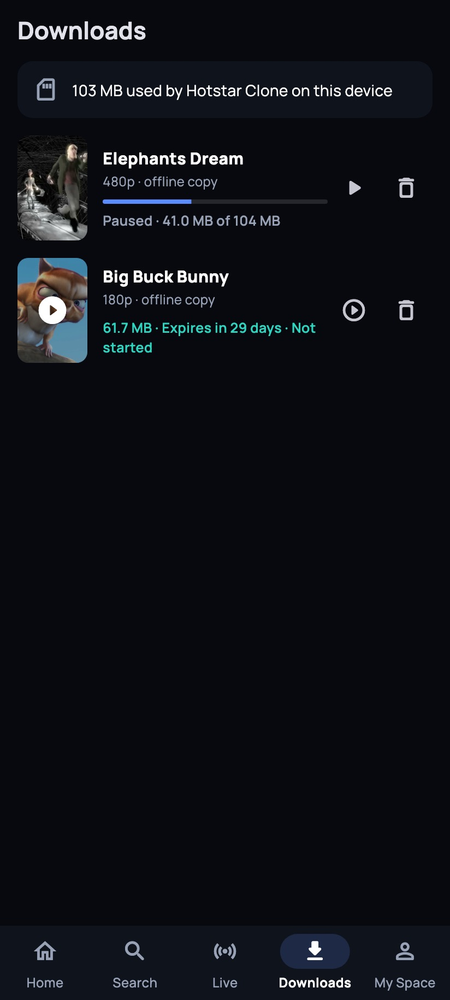
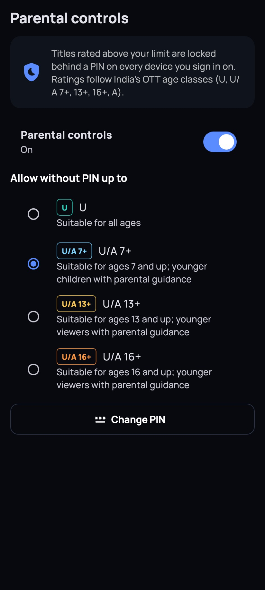
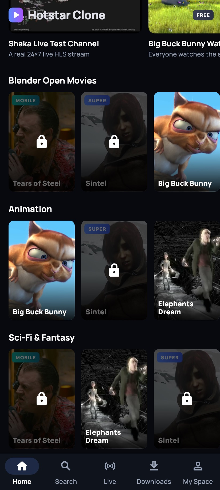

# Hotstar Clone — a Flutter OTT streaming app

> CPAD case study **144 · Hotstar OTT Platform**. This is a **Hotstar clone** built for the case study. It ships none of Disney+ Hotstar's assets, code or content, every video is an openly licensed Blender open movie (CC BY) or a labelled public test stream, and all artwork is generated from those frames. The name is a plain "clone" label, not a claim to be the real product.

Hotstar Clone is a Material 3, Riverpod and Firebase streaming app. It has adaptive 360p→4K HLS playback, live channels with real-time chat and reactions, offline downloads that expire, multi-language audio and subtitles, parental PIN controls, cross-device continue watching, and the four subscription tiers from the case study.

Every video is either an openly licensed [Blender open movie](https://studio.blender.org/films/) (CC BY) or a clearly labelled public test stream. All artwork is real frames grabbed from those videos by `tool/make_artwork.sh`.

| | | | |
|---|---|---|---|
|  |  |  |  |
|  |  |  |  |

---

## Case-study checklist → where it lives

| Required feature | How it works | Code |
|---|---|---|
| Adaptive bitrate 360p → 4K | HLS through ExoPlayer/AVPlayer (`video_player` 2.14), with a quality picker (Auto + each rung). 4K comes from a 3840×2048 test stream. | `features/player/` |
| Live streaming + chat + reactions | A real 24×7 live HLS channel, a clock-synced watch party, and an optional channel from your own laptop (OBS → MediaMTX). Chat and emoji use Firestore real-time listeners. | `features/live/` |
| Download manager with expiry | Progressive file over HTTP Range requests (pause/resume), stored in Hive. Kept for 30 days, or 48 h after first play, whichever is sooner, with a clock that ignores winding the date back. | `features/downloads/` |
| Multi-language audio + subtitles | HLS alternate audio (Tears of Steel: English/Italian). Sidecar SRT subtitles in up to 9 languages, including **বাংলা, മലയാളം, ਪੰਜਾਬੀ** for Sintel. | `player/application/subtitle_loader.dart` |
| Parental controls with PIN | Salted SHA-256 PIN, India's IT Rules 2021 age classes (U → A), a 5-try lockout, and per-session unlocks. | `features/parental/` |
| Continue watching across devices | `users/{uid}/progress/{title}` in Firestore, saved every 10 s and on pause. Resume on any device. | `features/progress/` |
| Rating, duration, year, cast & crew, similar, reviews with spoilers | Real credits (checked against Wikipedia), on-device recommender (Jaccard over genres/tags/crew), reviews with blurred spoilers. | `features/catalog/`, `features/reviews/` |
| Pricing tiers + tier badge | Free (ads, 480p, limited) · Mobile ₹499 (720p, phones only) · Super ₹899 (1080p, TV) · Premium ₹1,499 (4K, family sharing). | `features/subscription/` |

**Course rubric (A7.2):** 12 screens · Riverpod · go_router · Firestore + REST (HLS manifests, subtitles) · form validation (sign-in, reviews, chat, family invites, PIN) · local storage (Hive) · Material 3 · feature-first folders · repository layer · GitHub Actions running `flutter analyze` + `flutter test`, and building the release APK.

---

## Architecture

```
lib/
  core/            config, router (auth redirect + adaptive shell), theme, shared widgets, utils
  features/<name>/
    domain/        pure Dart: models + rules (unit-tested, no Flutter/Firebase)
    data/          repositories: abstract interface + Firebase implementation
    application/   use-case glue (e.g. playback resolver, parental gate)
    presentation/  screens and widgets (ConsumerWidgets)
```

* **State:** Riverpod 3. The auth state is a `StreamProvider`; the profile, plan, progress, reviews and chat are Firestore streams; downloads use a `Notifier`. `effectivePlanProvider` combines your own plan with any family Premium that includes you.
* **Repository pattern:** every screen talks to an interface (`AuthRepository`, `ProgressRepository`, …). Tests and the screenshot tool swap in in-memory fakes (`test/support/fakes.dart`).
* **Routing:** go_router with a `StatefulShellRoute` that keeps each tab's state. The auth redirect goes through a `refreshListenable`. The shell uses a bottom `NavigationBar` on phones and a `NavigationRail` from 840 dp up (tablet/TV).
* **Security:** `firestore.rules` repeats every client validation on the server. `tool/rules_smoke_test.py` proves it with 13 real allow/deny requests against the emulators.

### The interesting bits (viva notes)

**1. How can Free be capped at 480p without losing adaptive bitrate?**
`video_player` can't say "adapt, but never above 720p". So before playback, `PlaybackResolver` downloads the HLS **master playlist**. `HlsManifest.capped()` rewrites it without the renditions above the plan's cap, turns relative URIs into absolute ones, and saves it to the temp directory. ExoPlayer then plays that local master and still switches freely among the allowed rungs. That's manifest manipulation, the same idea OTT backends use server-side. If the local playlist fails on a device, the player falls back to the original stream and pins the best allowed track. Tests: `test/domain/hls_manifest_test.dart`, run on real Mux and Unified Streaming manifests.

**2. Why `video_player`, not media_kit?** media_kit uses mpv, and mpv picks one HLS variant when the video opens: no real ABR. `video_player` ≥ 2.14 wraps ExoPlayer/AVPlayer, which do true ABR, and now exposes `getVideoTracks()` / `selectVideoTrack()` / `getAudioTracks()` / `selectAudioTrack()`.

**3. How is the watch party "live" with no streaming server?** Every device computes the same playhead: `(now − fixed anchor) mod loop length`. It re-seeks if it drifts by more than 3 s, and handles the wrap-around at the end of the loop. Phones sync their clocks over the network, so devices agree to within about a second. The chat is real-time through Firestore.

**4. Why doesn't changing the phone's date extend a download?** `TamperProofClock` stores the latest time it has ever seen in Hive and never goes backwards.

**5. Why not download HLS for offline?** That means hundreds of segments per quality plus playlist rewriting, which needs native download managers. A single progressive file with HTTP Range requests gives pause/resume in plain Dart. Real OTTs also wrap offline files in **DRM (Widevine/FairPlay)**. This app doesn't, and says so.

**6. Isn't a 4-digit PIN hash weak?** Yes. There are only 10,000 PINs, so the salted hash just keeps it out of plain sight. The real protection is the 5-attempt, 30-second lockout.

**7. Tears of Steel shows numbers in the corner.** That's the Unified Streaming demo burning the current bitrate into the picture. You can literally watch ABR switch quality as your network changes.

---

## Content & licences

| Title | Source | Licence |
|---|---|---|
| Tears of Steel (2012) | Unified Streaming HLS (EN/IT audio) + Blender subtitles | CC BY 3.0 · Blender Foundation |
| Sintel (2010) | Shaka Player AES-128 HLS + Blender subtitles | CC BY 3.0 · Blender Foundation |
| Big Buck Bunny (2008) | Mux test HLS, 184p–1080p | CC BY 3.0 · Blender Foundation |
| Elephants Dream (2006) | download.blender.org (progressive, not adaptive) | CC BY 2.5 · Blender Foundation |
| Shark Dive 360° (4K) | THEOplayer public test stream, 3840×2048 | © National Geographic, test stream only, **not CC** |
| Shaka Live Test Channel | Google's Shaka Player live test stream | Test stream |

Font: Manrope (SIL OFL). Every stream URL was probed before it went in the catalogue; the Akamai "live test" stream was dropped because its media playlists return 404.

---

## Run it

**Backend (your laptop):** Firebase Emulator Suite. No Firebase project or card needed.

```bash
./tool/dev.sh          # starts Auth + Firestore emulators and prints your Wi-Fi IP
```

**App (your phone, wireless debugging):**

1. Phone and laptop on the same Wi-Fi. On the phone: *Developer options → Wireless debugging → Pair device with pairing code*.
2. `adb pair <ip>:<pair-port>` (enter the code), then `adb connect <ip>:<port>`.
3. `flutter run --dart-define=EMULATOR_HOST=<laptop-ip>` (the exact command is printed by `dev.sh`).

If the phone can't reach the laptop, allow incoming connections for Java in *macOS System Settings → Network → Firewall*.

**Optional: go live from your laptop.** Run [MediaMTX](https://github.com/bluenviron/mediamtx), stream to it from OBS at `rtmp://<laptop-ip>:1935/studio`, then add `--dart-define=LIVE_URL=http://<laptop-ip>:8888/studio/index.m3u8`. A *Hotstar Clone Studio* channel appears under Live.

**Real Firebase later:** `flutterfire configure`, pass the generated options in `core/config/firebase_setup.dart`, and run with `--dart-define=USE_EMULATORS=false`.

## Test it

```bash
flutter analyze                     # 0 issues
flutter test                        # 53 tests: domain rules + widgets
firebase emulators:exec --only auth,firestore --project demo-hotstar-clone \
  "python3 tool/rules_smoke_test.py"  # 13 allow/deny checks against the real rules (needs Java)
flutter test tool/screenshots/screens_test.dart --update-goldens   # re-render the screenshots above
```

## Known limits (honest list)

* **Demo checkout.** Changing plans writes `plan` from the client, and the rules allow it. Production would set `plan` from a payment webhook (a Cloud Function) and lock that field in the rules. The exact line is commented in `firestore.rules`.
* **No DRM** on streams or downloads. Quality caps and plan checks are client-side, so production needs signed URLs and licence policies.
* **Test streams are third-party** and can change or disappear. Self-hosting HLS (ffmpeg → Cloudflare R2) is the next step.
* **Not yet run on a device.** Everything above is verified by analysis, 53 tests, the rules smoke test and offscreen renders of every screen. Real playback (ExoPlayer, track switching, the capped local manifest) still needs a first run on an Android phone. iOS hasn't been built at all (Xcode isn't set up on the dev machine).
* The Mobile plan's "phones only" rule uses screen size (shortest side ≥ 600 dp counts as a large screen), not a device-type API.
