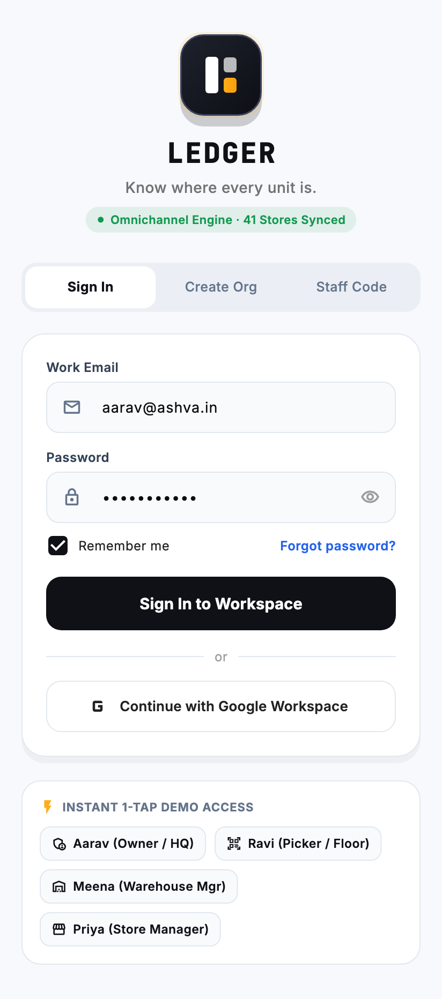
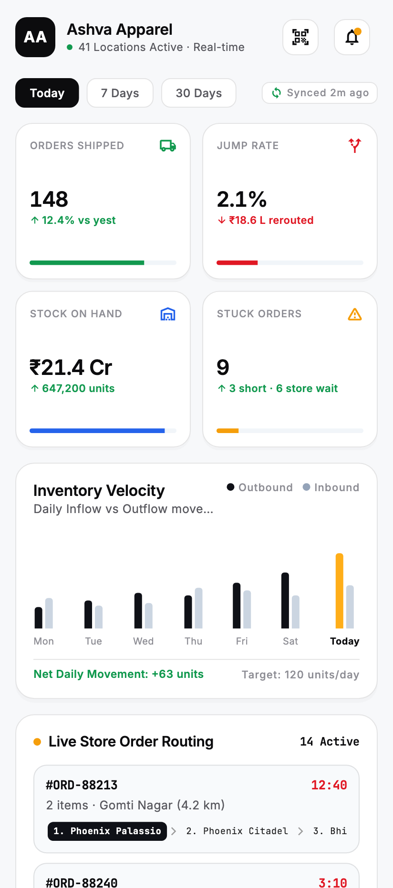
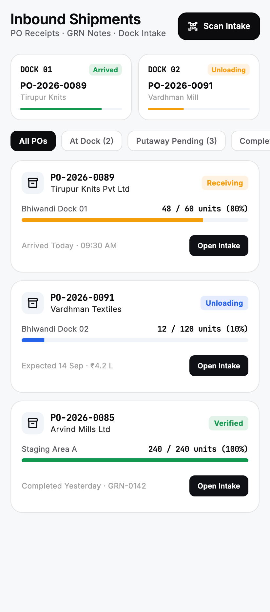
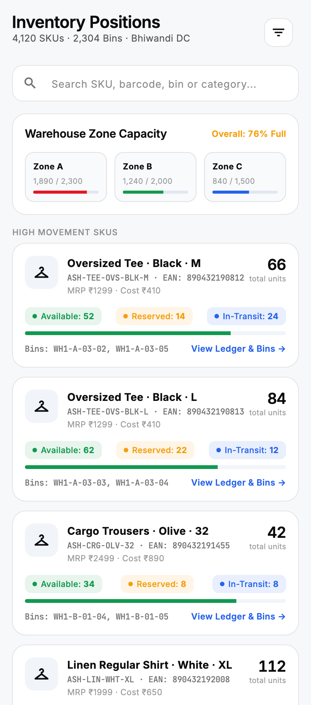
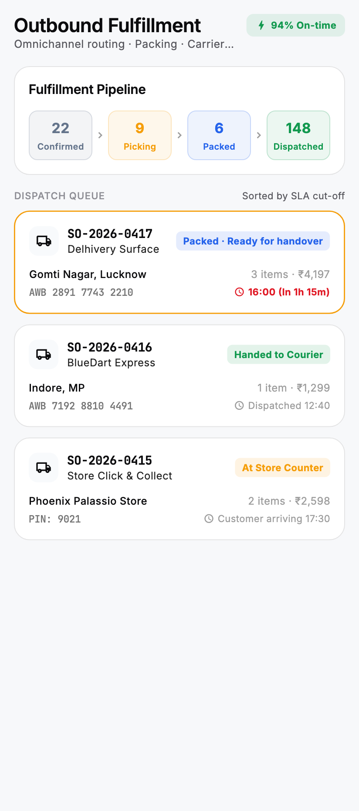
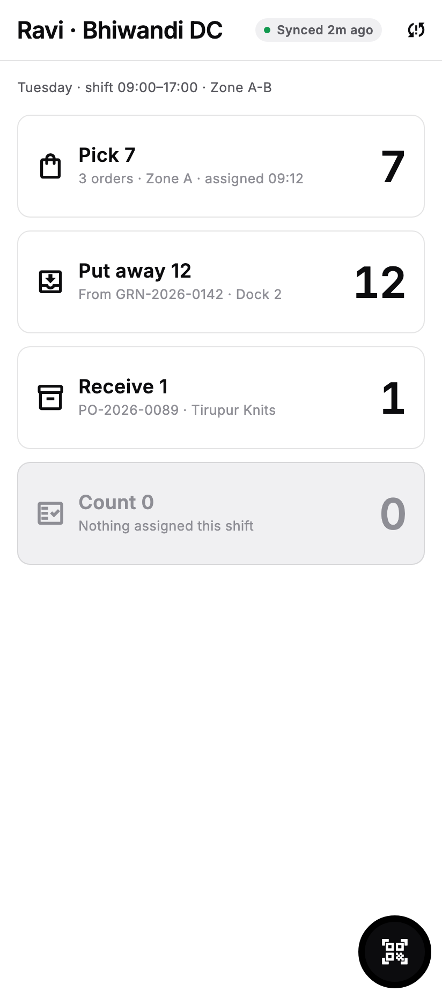
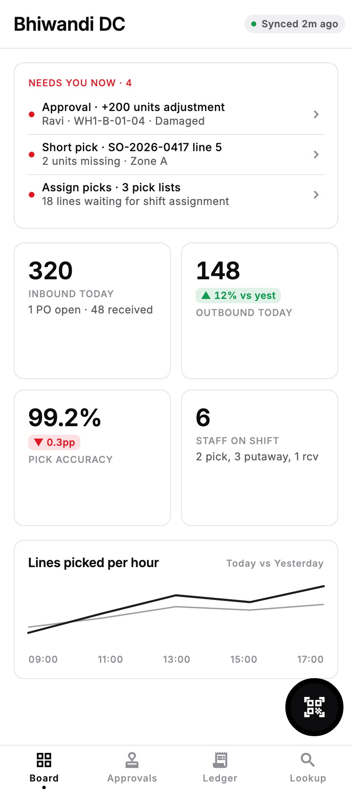
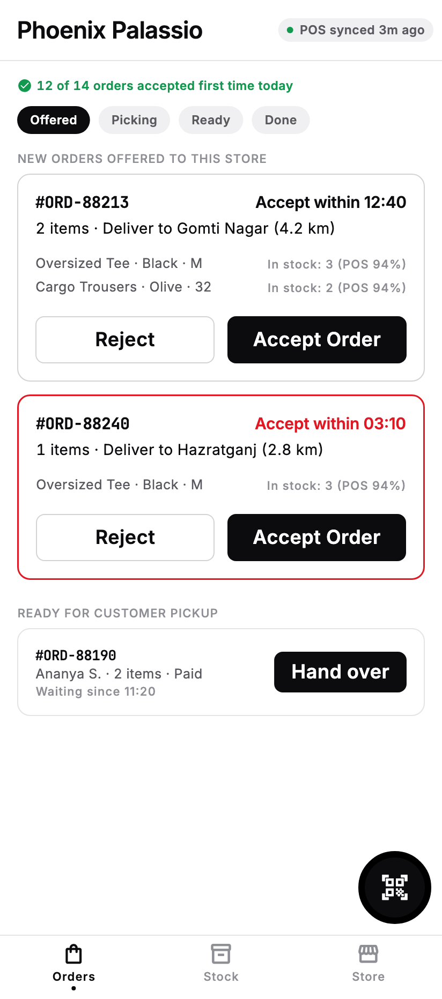
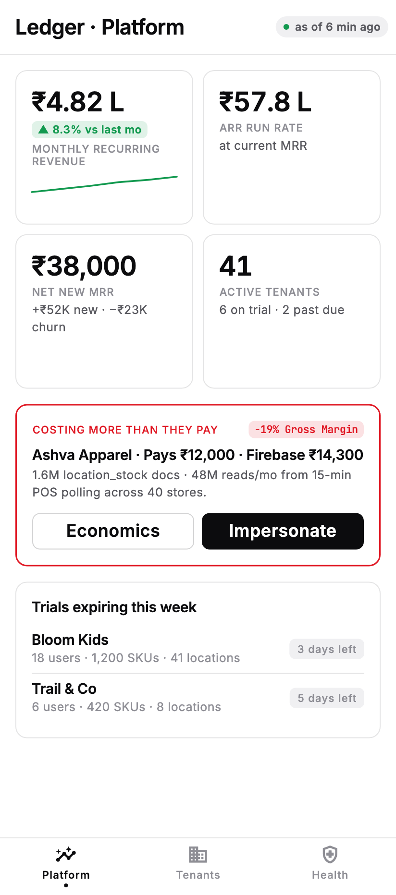

# warevo

a mobile warehouse management app that actually knows where every unit is.

built with flutter as the cross platform app development mini project, sem 5. it's a working
role-based prototype (mock data, no backend needed to run), designed as a multi-tenant SaaS a
business would sign up for and run its whole warehouse + retail stock from a phone.

> **mini project submission** · Cross Platform App Development · Sem 5
> built by **Anshuman Atrey** and **Ayush Jha**

---

## the problem it solves

think of any clothing brand that sells online and also has physical stores. the stock is sitting
right there, but the software does not reliably know *where*. so an online order gets sent to a
store whose stock count is wrong, the staff cant find the item, and the order either bounces to
another store or just dies.

thats not a small thing. measured on a real indian D2C brand running 40 stores + 1 warehouse,
1.2 to 4.2% of orders jump between locations because the numbers lied. most tools ship a dashboard
tab just to *measure* that pain. nobody closes the loop.

warevo closes it with one idea: **treat stores and warehouses as the same thing, a typed location.**
a warehouse gets stock from receiving, a store gets stock from its POS, but both feed one sellable
pool, and every stock number carries who said it and when. like a bank ledger, a number without a
timestamp is just a guess wearing a suit.

## the design idea (in one line)

a warehouse is basically a **ledger** (every unit that moves is one entry) plus a **derived position**
(what is on hand right now). so the source of truth is the append-only list of moves, and the
"how many do i have" number is just a running total on top. same way your bank statement is the truth
and your balance is derived from it, you dont edit the balance directly.

full architecture + firebase data model is in [`docs/PLAN.md`](docs/PLAN.md), the visual system
(Ledger Mono, the white/black/grey look) is in [`docs/DESIGN.md`](docs/DESIGN.md). the screens were
first prototyped in **Google Stitch**: https://stitch.withgoogle.com/projects/10739278766338428278

---

## screenshots

one app, five very different jobs depending on who logs in. tap any demo card on the login screen
to jump straight into that role.

### login, one tap per role


### owner / HQ (the polished "modern" shell)
the founder's view. live board, KPIs, and the warehouse ops tabs (inbound, inventory, outbound).

<p>




</p>

### floor / picker, manager, store, super-admin
each role lands on its own screen. the picker gets a scan-first pick flow, the manager approves
adjustments, the store manager handles omni orders, the super-admin runs tenants and can impersonate
any org for support.

<p>




</p>

---

## roles

| role | who they are | what they do in the app |
|------|--------------|-------------------------|
| **Owner** | founder / HQ | live board, KPIs, warehouse ops, org settings |
| **Floor** | picker / packer | scan-driven pick flow, one bin at a time |
| **Manager** | warehouse manager | approves stock adjustments, counts, transfers |
| **Store** | store manager | accepts/rejects omni orders, store stock |
| **Super-Admin** | the platform (us) | tenants, plans, support impersonation |

## how to run

needs flutter 3.13+ (tested on 3.47.5).

```bash
flutter pub get
flutter run           # pick a device, or: flutter run -d chrome / -d macos
```

on the login screen, tap a demo card (Aarav = owner, Ravi = picker, Meena = manager,
Priya = store) to jump into that role instantly. manual login also works, default is
`aarav@ashva.in` / `password123`.

## tests

```bash
flutter test
```

covers the app booting cleanly plus the state logic (role switching, the bin-count grid math,
impersonation, moving an order into picking).

---

## what changed from the base repo

the base was a solid set of screens but a few things were loose, so i tightened them for submission:

- **wired up role-based routing.** this is the big one. all five role screens (floor, manager,
  store, super-admin, and the owner shell) were fully built but never actually shown, the app logged
  you in, set your role, then ignored it and showed the same screen to everyone. now each role lands
  on its real home. it's like the building had five key-card doors already installed but none of them
  were connected to the reader, i just connected them.
- **fixed the broken smoke test** (it was looking for a label the splash screen never shows) and
  added real unit tests on the app state.
- **wrote this readme with actual screenshots** instead of the default flutter boilerplate.
- `flutter analyze` is clean, no issues.

## project structure

```
lib/
  core/          theme (Ledger Mono tokens) + shared widgets (app bar, nav, kpi card, scanner)
  data/          mock_database.dart  (all the fake stock, orders, ledger entries)
  features/      one folder per screen: auth, dashboard, inbound, inventory, outbound,
                 floor, manager, store, super_admin, splash
  state/         app_state.dart  (ChangeNotifier, the single source of truth for the UI)
  main.dart      splash -> login -> role-based home
docs/
  PLAN.md        full SaaS architecture + firebase data model
  DESIGN.md      Ledger Mono design system
  STITCH_*.md    per-role screen specs (from the Google Stitch prototype)
screenshots/     the images used in this readme
```

## a note on scope

this is a **front-end prototype**, everything runs off `mock_database.dart` so it demos instantly
with no backend. the real firebase backend (append-only ledger, cloud functions, offline sync) is
designed out in [`docs/PLAN.md`](docs/PLAN.md) but not wired up here, that's the next phase.

built by Anshuman Atrey and Ayush Jha.
