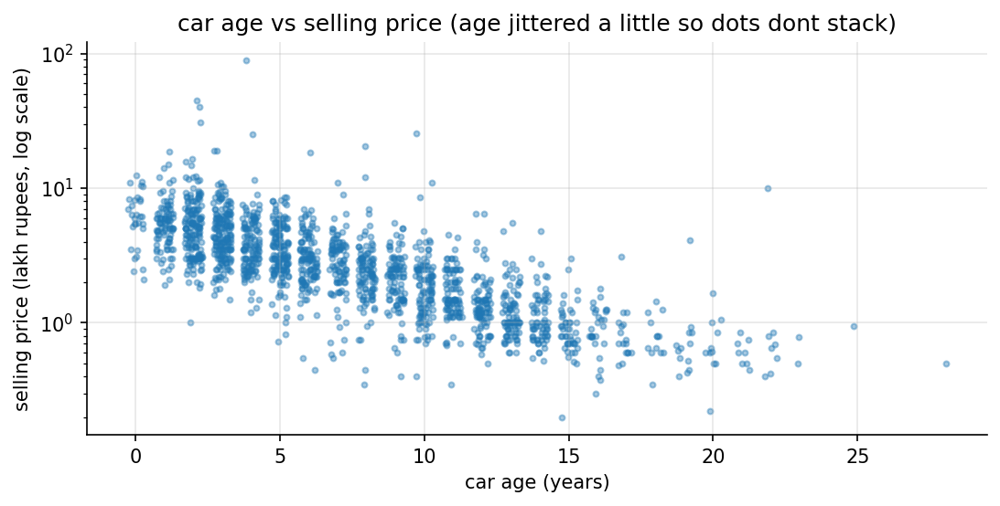

# assignment 3, used car price prediction (cardekho)

Linear Regression on the kaggle [Vehicle dataset from CarDekho](https://www.kaggle.com/datasets/nehalbirla/vehicle-dataset-from-cardekho)
(`CAR DETAILS FROM CAR DEKHO.csv`), on my personalised subset: roll number 150096724029 mod 3 = 0, so **Petrol** cars
(2,123 listings). the same task is also posted on Lisa as `Assignment-3`.

**test R² 0.840** (train 0.868, 5-fold cross-validation 0.848 ± 0.016). the pass condition was 0.75.

## in plain words

1. **The task:** predict what a used car sells for on CarDekho, from its age, kilometres driven, gearbox, owner history and more, using Linear Regression.
2. **My slice of the data:** my roll number decides the fuel type (roll number mod 3 = 0, so Petrol). That gave 2,123 Petrol car listings.
3. **Cleaning:** 406 listings were exact copies, so they went, leaving 1,717 cars. Car age came from the year (the newest listing is from 2020), and the brand and model came from the car's name.
4. **Prices are lopsided:** 80% of the cars sell for under ₹5 lakh, but a few go up to ₹89 lakh. The logarithm of the price fixes that lopsided shape.
5. **Cars lose value in percentages:** on a log scale, price falls in a straight line with age, about 8.6% every year. Old cars also have more kilometres, so age and km tell partly the same story.
6. **The first model was weak:** using only the handout's features (age, km, gearbox, owner), it explained 42% of the price differences on cars it hadn't seen.
7. **What helped:** the log of price (to 62%), removing the most extreme cars (65%), adding the seller type (66%) and the brand (70%).
8. **The big jump:** the car model. A Maruti Alto and a Maruti Ciaz of the same age cost completely different amounts, and adding the model took it to 84%.
9. **The final score:** test R² 0.840 on cars it never saw (the pass mark was 0.75). Training R² is 0.868 and 5 different splits average 0.848, so it isn't memorising.
10. **What lowers resale value most:** each extra year of age -8.6%, a manual gearbox -14% against an automatic, selling as an individual -11% against a dealer, and every 10,000 km -2%.
11. **Limitations:** the typical error is about ₹55,000, and car models seen fewer than 10 times are lumped into "other", so rare cars are guessed less well.
12. **What gets handed in:** the notebook, the 1-page summary PDF, and the full report (PDF and Word) with every step's explanation, code and output screenshot.

## whats in here

| file | what it is |
|---|---|
| `used_car_price_cardekho.ipynb` | **deliverable 1:** the notebook, executed, with all outputs |
| `Assignment-3-Summary.pdf` | **deliverable 2:** the 1-page summary report |
| `Assignment-3-Used-Car-Price-CarDekho-Report.docx` | the doc file of code and output (every step: explanation -> code -> output screenshot) |
| `Assignment-3-Used-Car-Price-CarDekho-Report.pdf` | the same report as a PDF |
| `figures/` | the 6 plots: price distribution, price by transmission, age vs price, km vs price, correlation heatmap, actual vs predicted |
| `screenshots/` | one screenshot per code output |
| `report/` | `build_report.py`, `summary.md` (source of the 1-page summary), the pdf styles and the word template |
| `BRIEF.md` + `handout.pdf` | the assignment as posted on Classroom |
| `data/` | the kaggle csv files, downloaded locally and gitignored |

## the iterations

| step | rows | test R² | 5-fold CV R² |
|---|---|---|---|
| v1 handout features (age, km, transmission, owner), price as is | 1,717 | 0.418 | 0.350 |
| v2 + log of price | 1,717 | 0.621 | 0.629 |
| v3 + extreme outliers removed (1% cheapest / priciest, 1% most km) | 1,667 | 0.651 | 0.630 |
| v4 + seller type | 1,667 | 0.664 | 0.643 |
| v5 + brand | 1,667 | 0.703 | 0.722 |
| **v6 + model (final)** | 1,667 | **0.840** | **0.848 ± 0.016** |



## how to run it

```bash
cd "Machine Learning/Assignment 3 - Used Car Price Prediction (CarDekho)"
kaggle datasets download -d nehalbirla/vehicle-dataset-from-cardekho -p data --unzip
pip install pandas numpy matplotlib scikit-learn nbconvert ipykernel
jupyter nbconvert --to notebook --execute --inplace used_car_price_cardekho.ipynb
python report/build_report.py    # needs pandoc + weasyprint (brew) and playwright's chromium
```
