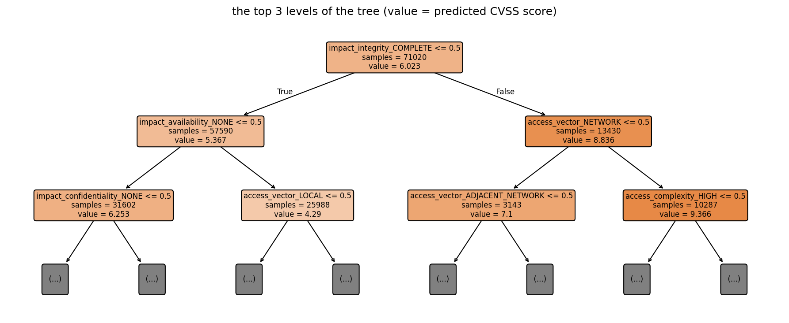

# assignment 6, decision tree regressor for vulnerability severity

the handout allows "any other suitable regression dataset from Kaggle", so i picked one that matters for
[Walrus Securitas](https://walrussecuritas.com/) (the AI security testing platform im building, which ranks findings by
how dangerous they are): predict a vulnerability's **CVSS severity score** (0 to 10) on the kaggle
[CVE dataset](https://www.kaggle.com/datasets/andrewkronser/cve-common-vulnerabilities-and-exposures), 89,660 real CVEs.

**R² 0.9997 on the test set** (MAE 0.001, RMSE 0.033), with one Decision Tree Regressor in 49 lines of code.

## in plain words

1. **The task:** predict a software vulnerability's severity score (CVSS, from 0 to 10) with a Decision Tree Regressor.
2. **Why this dataset:** security teams fix the most dangerous problems first, and ranking findings by danger is exactly what Walrus Securitas (the company im building) does.
3. **The data:** 89,660 real published vulnerabilities from Kaggle, each with its official score and the 6 facts the score is built from.
4. **The 6 facts:** how the attacker gets in (over the network or only on the machine), how hard the attack is, whether a login is needed, and how badly it hurts the data's secrecy, its integrity, and the system staying up.
5. **Cleaning:** 884 vulnerabilities were missing those facts, so they were dropped, leaving 88,776. The text facts became 0/1 columns, since the tree needs numbers.
6. **What a decision tree does:** it's a flowchart of yes/no questions, like a hospital triage desk. Each path of answers ends in a predicted score.
7. **The first question it learned:** "can the attack fully take over the data's integrity?" If yes, the average score jumps to 8.8 out of 10. The next question is whether it works over the network.
8. **The result:** R² 0.9997 on vulnerabilities it never saw, with a typical error of 0.001 points.
9. **Why so accurate:** the official score is calculated by a fixed formula from those 6 facts, and only 287 different combinations appear. The tree rediscovered the official calculator from examples.
10. **What matters most:** the damage facts alone explain 79% of the score, the access facts alone only 16%. Severity is mostly about how much damage, not how the attacker gets in.
11. **The honest catch:** this only works once someone knows those 6 facts. Predicting the score from just the type of weakness is much harder.
12. **What gets handed in:** one Word document (plus a PDF copy) with my name, roll number, the dataset link, the code, output screenshots, results, plots and the conclusion.

## whats in here

| file | what it is |
|---|---|
| `Assignment-6-Decision-Tree-CVE-Severity.docx` | **the submission** (the handout asks for one Word document): name, roll number, dataset + link, code, output screenshots, results, plots, conclusion |
| `Assignment-6-Decision-Tree-CVE-Severity.pdf` | the same document as a PDF |
| `decision_tree_cve_severity.ipynb` | the notebook, executed, with all outputs |
| `figures/` | actual vs predicted, and the top of the tree |
| `screenshots/` | one screenshot per code output |
| `report/` | `build_report.py`, the pdf styles and the word template |
| `BRIEF.md` + `handout.pdf` | the assignment as posted on Classroom |
| `data/` | the kaggle `cve.csv`, downloaded locally and gitignored |

## results

| metric | test set |
|---|---|
| MAE | 0.0010 |
| MSE | 0.0011 |
| RMSE | 0.0334 |
| R² | **0.9997** (train 1.0000) |



## how to run it

```bash
cd "Machine Learning/Assignment 6 - Decision Tree Regressor (CVE Severity)"
kaggle datasets download -d andrewkronser/cve-common-vulnerabilities-and-exposures -f cve.csv -p data
pip install pandas numpy matplotlib scikit-learn nbconvert ipykernel
jupyter nbconvert --to notebook --execute --inplace decision_tree_cve_severity.ipynb
python report/build_report.py    # needs pandoc + weasyprint (brew) and playwright's chromium
```
