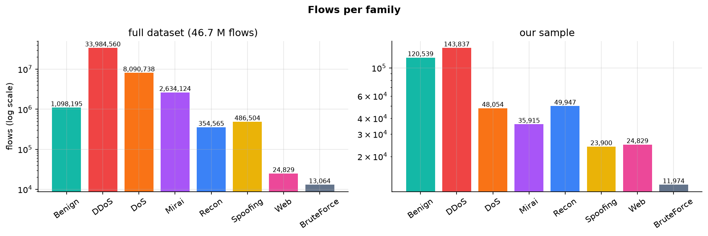
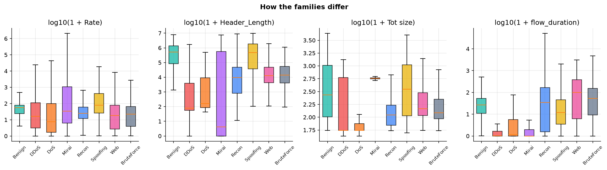
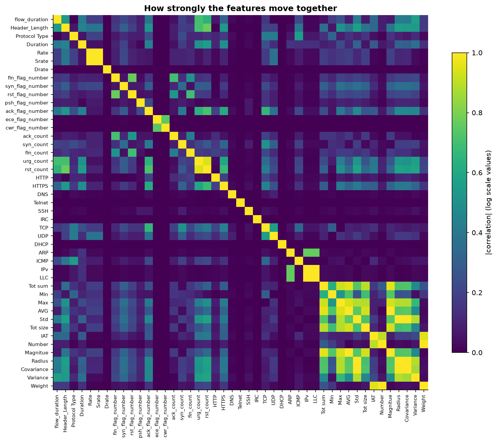
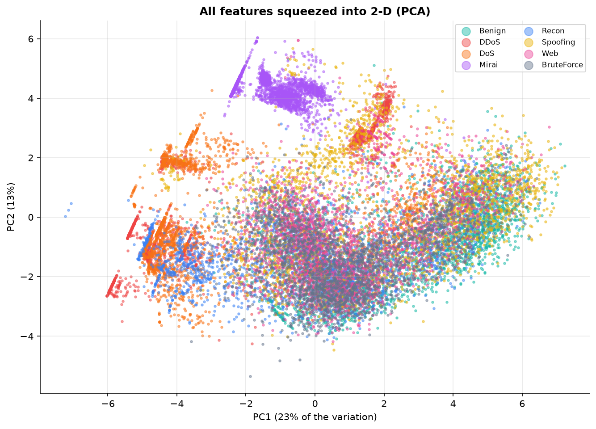
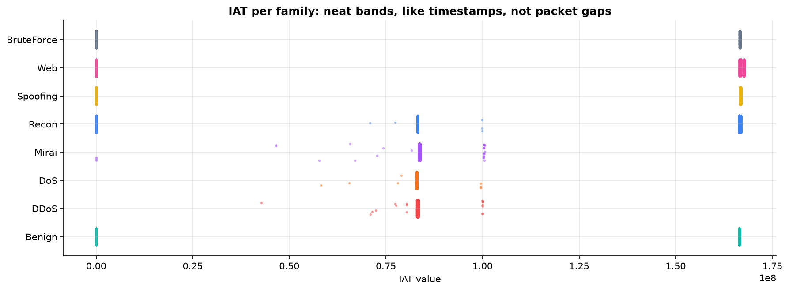
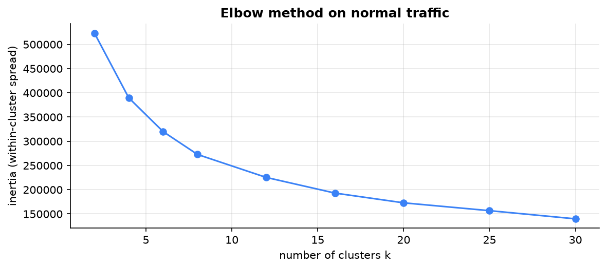
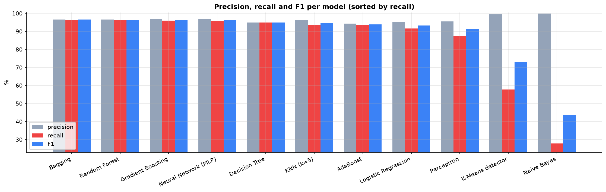

# how it works, start to end (case study 148)

every number in this file comes from the real run: the executed notebook
([intrusion_detection.ipynb](intrusion_detection.ipynb)), [reports/results.json](reports/results.json), or the saved model. nothing
is rounded up or made up.

```
46.7 million rows of recorded network traffic
  → keep a fair 458,995 rows
  → check for mistakes, turn the answer column into 0/1 and into 7 attack families
  → look at the data (EDA), find and remove one cheating column
  → lock away 25% of rows as the final exam
  → make all 45 numbers comparable (shrink, then compare to typical)
  → 11 different algorithms each learn their own rule from 344,246 rows
  → each one answers the 114,749 locked rows
  → count right and wrong answers → percentages → compare
  → best practical one goes into the website
```

---

## 1. where the data comes from

**name:** CICIoT2023. **made by:** the Canadian Institute for Cybersecurity (CIC) at the University of New Brunswick,
Canada. **paper:** Neto, Dadkhah, Ferreira, Zohourian, Lu, Ghorbani, *"CICIoT2023: A Real-Time Dataset and Benchmark
for Large-Scale Attacks in IoT Environment"*, Sensors 23(13):5941, June 2023
([paper](https://pmc.ncbi.nlm.nih.gov/articles/PMC10346235/), [dataset page](https://www.unb.ca/cic/datasets/iotdataset-2023.html)).

**how they made it:**

1. **they built a small smart home / office in their lab:** 105 real devices. smart cameras (Amcrest, Arlo, D-Link,
   Nest, TP-Link Tapo, Wyze and more), smart speakers (Amazon Echo, Google Nest Mini, Sonos), smart plugs and bulbs
   (Wemo, Philips Hue, LIFX), sensors (door, flood, motion), a smart TV, a robot vacuum, a coffee maker, and 38
   Zigbee / Z-Wave devices behind 5 hubs.
2. **7 Raspberry Pi mini computers played the attackers.** they attacked the other devices in 33 different ways,
   using real attack tools: `hping3` (floods), `nmap` and `fping` (scanning), `ettercap` (spoofing), DVWA (web
   attacks), and an adapted copy of the real **Mirai** botnet code. they also recorded normal traffic with no attack
   running.
3. **they recorded every packet.** a hardware "network tap" (Gigamon) copied all traffic, and Wireshark saved it as
   `.pcap` files (raw recordings of every packet).
4. **they turned packets into rows of numbers.** they cut the recordings into 10 MB pieces (`tcpdump`), read every
   packet with a Python library called `DPKT`, worked out 46 numbers per packet, and then **averaged them over a
   window of 10 or 100 packets** (100 for the big floods). so **one row = a summary of a small batch of packets**. that
   is why some "counts" in the data are decimals, like `rst_count = 232.6`: it is an average.
5. **they labelled every row** with what was really happening (e.g. `DDoS-ICMP_Flood` or `BenignTraffic`) and saved
   it all as **169 CSV files** (CSV = a plain text table, one row per line, values separated by commas).

**the 33 attacks, in 7 families** (+ normal traffic):

| family | what it is, in plain words | attacks in it |
|---|---|---|
| DDoS | many devices flood one target with junk traffic at once, so it chokes | 12: ICMP flood, UDP flood, TCP flood, SYN flood, PSH-ACK flood, RST-FIN flood, SynonymousIP flood, ICMP / UDP / ACK fragmentation, HTTP flood, SlowLoris |
| DoS | the same flooding, from one device | 4: TCP, UDP, SYN, HTTP flood |
| Mirai | the Mirai botnet: hijacked smart devices used as a flooding army | 3: GRE-IP flood, GRE-ETH flood, UDP plain |
| Recon | "casing the house": scanning to find devices, open doors and weak spots | 5: ping sweep, OS scan, port scan, host discovery, vulnerability scan |
| Spoofing | pretending to be someone else on the network | 2: ARP spoofing (man-in-the-middle), DNS spoofing |
| Web | attacking a website through its forms and pages | 6: SQL injection, command injection, XSS, browser hijacking, backdoor malware, uploading attack |
| BruteForce | guessing passwords from a list | 1: dictionary brute force |

**how we got it:** the same 169 CSV files are mirrored on Kaggle as
[UNB CIC IOT 2023](https://www.kaggle.com/datasets/madhavmalhotra/unb-cic-iot-dataset) (about 3 GB). the notebook ran
on a free Kaggle computer, where that dataset is attached to the notebook as a read-only folder (`/kaggle/input`), so
nothing had to be downloaded to the laptop.

---

## 2. what the raw data looks like (the first 6 rows, all 47 columns)

this is literally the start of the first file, `part-00000-...csv`, read with pandas:

```python
import pandas as pd
df = pd.read_csv("part-00000-363d1ba3-8ab5-4f96-bc25-4d5862db7cb9-c000.csv")
df.shape        # (238687, 47) → this one file has 238,687 rows and 47 columns
df.head(6)      # the first 6 rows
```

**what "a row" is:** one row = one small batch of recorded traffic between devices (10 or 100 packets, summarised).
the file is a long list of these batches, one per line. each batch has 46 numbers describing it, and a 47th column
(`label`) saying what it really was.

this is how the first 6 batches look in the file itself, **as rows** (only 5 of the 47 columns fit across the page):

| batch | flow_duration | Header_Length | Rate | TCP | … 42 more columns … | label (what it really was) |
|---|---|---|---|---|---|---|
| 1st line of the file | 0 | 54 | 0.33 | 1 | … | DDoS-RSTFINFlood |
| 2nd line | 0 | 57.04 | 4.29 | 1 | … | DoS-TCP_Flood |
| 3rd line | 0 | 0 | 33.40 | 0 | … | DDoS-ICMP_Flood |
| 4th line | 0.328 | 76,175 | 4,642.13 | 0 | … | DoS-UDP_Flood |
| 5th line | 0.117 | 101.73 | 6.20 | 1 | … | DoS-SYN_Flood |
| 6th line | 0 | 0 | 1.95 | 0 | … | Mirai-greeth_flood |

so the 4th batch, for example, was a DoS UDP flood: it lasted 0.328 seconds and sent 4,642 packets per second. (the
file happens to start with 6 attacks; normal batches, labelled `BenignTraffic`, come further down. section 8 follows
a normal one.)

47 columns don't fit across a page, so below the same 6 batches are **turned sideways**: each of the 47 columns
becomes a line, and **each of the 6 batches becomes a column**. read **down** a column to see all 47 numbers of one
batch. the headings say what each batch really was:

| column | what it means, in plain words | batch 1: DDoS RST-FIN flood | batch 2: DoS TCP flood | batch 3: DDoS ICMP (ping) flood | batch 4: DoS UDP flood | batch 5: DoS SYN flood | batch 6: Mirai botnet flood |
|---|---|---|---|---|---|---|---|
| flow_duration | how long the connection has been going (seconds) | 0 | 0 | 0 | 0.328 | 0.117 | 0 |
| Header_Length | total size of the packets' "envelopes" (headers), in bytes | 54 | 57.04 | 0 | 76,175 | 101.73 | 0 |
| Protocol Type | which protocol, as a code: 6 = TCP, 17 = UDP, 1 = ICMP, 47 = GRE | 6 | 6.33 | 1 | 17 | 6.11 | 47 |
| Duration | "time to live": how many hops a packet may travel (64 is the normal Linux value) | 64 | 64 | 64 | 64 | 65.91 | 64 |
| Rate | packets per second | 0.33 | 4.29 | 33.40 | 4,642.13 | 6.20 | 1.95 |
| Srate | packets per second going out | 0.33 | 4.29 | 33.40 | 4,642.13 | 6.20 | 1.95 |
| Drate | packets per second coming in | 0 | 0 | 0 | 0 | 0 | 0 |
| fin_flag_number | was the "goodbye" signal (FIN) set? 1 = yes | 1 | 0 | 0 | 0 | 0 | 0 |
| syn_flag_number | was the "hello, let's connect" signal (SYN) set? | 0 | 0 | 0 | 0 | 1 | 0 |
| rst_flag_number | was the "hang up now" signal (RST) set? | 1 | 0 | 0 | 0 | 0 | 0 |
| psh_flag_number | was the "deliver this right away" signal (PSH) set? | 0 | 0 | 0 | 0 | 0 | 0 |
| ack_flag_number | was the "got it" signal (ACK) set? | 0 | 0 | 0 | 0 | 0 | 0 |
| ece_flag_number | congestion warning signal (ECE) | 0 | 0 | 0 | 0 | 0 | 0 |
| cwr_flag_number | "I slowed down" signal (CWR) | 0 | 0 | 0 | 0 | 0 | 0 |
| ack_count | how many packets carried "got it" (averaged) | 1 | 0 | 0 | 0 | 0 | 0 |
| syn_count | how many packets carried "hello" (averaged) | 0 | 0 | 0 | 0 | 1.01 | 0 |
| fin_count | how many packets carried "goodbye" (averaged) | 1 | 0 | 0 | 0 | 0.04 | 0 |
| urg_count | how many packets were marked urgent (averaged) | 0 | 0 | 0 | 0 | 0 | 0 |
| rst_count | how many packets carried "hang up" (averaged) | 0 | 0 | 0 | 0 | 0.02 | 0 |
| HTTP | 1 if it was normal web traffic | 0 | 1 | 0 | 0 | 0 | 0 |
| HTTPS | 1 if it was secure web traffic | 0 | 0 | 0 | 0 | 0 | 0 |
| DNS | 1 if it was a "look up this website's address" message | 0 | 0 | 0 | 0 | 0 | 0 |
| Telnet | 1 if it was old-style remote login | 0 | 0 | 0 | 0 | 0 | 0 |
| SMTP | 1 if it was email sending | 0 | 0 | 0 | 0 | 0 | 0 |
| SSH | 1 if it was secure remote login | 0 | 0 | 0 | 0 | 0 | 0 |
| IRC | 1 if it was chat (IRC) | 0 | 0 | 0 | 0 | 0 | 0 |
| TCP | 1 if it used TCP (careful, guaranteed delivery) | 1 | 1 | 0 | 0 | 1 | 0 |
| UDP | 1 if it used UDP (fast, no guarantee) | 0 | 0 | 0 | 1 | 0 | 0 |
| DHCP | 1 if a device was asking for a network address | 0 | 0 | 0 | 0 | 0 | 0 |
| ARP | 1 if a device was asking "who has this address?" | 0 | 0 | 0 | 0 | 0 | 0 |
| ICMP | 1 if it was a ping / network error message | 0 | 0 | 1 | 0 | 0 | 0 |
| IPv | 1 if it used IP (the internet's addressing) | 1 | 1 | 1 | 1 | 1 | 1 |
| LLC | 1 if it used LLC (a low-level link protocol) | 1 | 1 | 1 | 1 | 1 | 1 |
| Tot sum | total bytes of all packets in the batch | 567 | 581.33 | 441 | 525 | 644.6 | 6,216 |
| Min | smallest packet size (bytes) | 54 | 54 | 42 | 50 | 57.88 | 592 |
| Max | biggest packet size | 54 | 66.3 | 42 | 50 | 131.6 | 592 |
| AVG | average packet size | 54 | 54.80 | 42 | 50 | 67.96 | 592 |
| Std | how much packet sizes differ from each other | 0 | 2.82 | 0 | 0 | 23.11 | 0 |
| Tot size | packet length | 54 | 57.04 | 42 | 50 | 57.88 | 592 |
| IAT | time gap since the previous packet (see section 6: it is really a clock) | 83,343,832 | 82,926,067 | 83,127,994 | 83,015,696 | 82,972,999 | 83,698,395 |
| Number | number of packets in the batch | 9.5 | 9.5 | 9.5 | 9.5 | 9.5 | 9.5 |
| Magnitue | square root of (average incoming size + average outgoing size) | 10.39 | 10.46 | 9.17 | 10.00 | 11.35 | 34.41 |
| Radius | square root of how much incoming and outgoing sizes vary | 0 | 4.01 | 0 | 0 | 32.72 | 0 |
| Covariance | how incoming and outgoing sizes move together | 0 | 160.99 | 0 | 0 | 3,016.81 | 0 |
| Variance | incoming size variation ÷ outgoing size variation | 0 | 0.05 | 0 | 0 | 0.19 | 0 |
| Weight | incoming packets × outgoing packets | 141.55 | 141.55 | 141.55 | 141.55 | 141.55 | 141.55 |
| **label** | **what it really was (the answer)** | DDoS-RSTFINFlood | DoS-TCP_Flood | DDoS-ICMP_Flood | DoS-UDP_Flood | DoS-SYN_Flood | Mirai-greeth_flood |

**the data's shape (its "dimensions"):** a table is described as *rows × columns*. this file is **238,687 × 47**; the
whole dataset is **46,686,579 × 47**. 46 columns are numbers (the *features*: what the model looks at), 1 column is
text (the *label*: the answer the model must learn to give).

**the tools we used:**

| library | what it is | what we used it for |
|---|---|---|
| **pandas** | tables in Python (like Excel, in code) | reading the CSVs, counting, cleaning, grouping |
| **NumPy** | fast arrays of numbers (a grid of numbers is a *matrix*) | the maths: log, averages, random sampling |
| **Matplotlib** | charts | all 16 figures in `figures/` |
| **scikit-learn** | the standard machine learning library | splitting, cleaning steps, all 11 models, every score |
| **SciPy** | science maths | the family tree chart (hierarchical clustering) |
| **joblib** | saving Python objects to a file | saving the trained models (`models/ids_bundle.joblib`) |

all versions are pinned in [requirements.txt](requirements.txt) and installed into a fresh *virtual environment* (an
isolated Python install, so other projects' versions can't interfere).

---

## 3. step 1: a fair sample (46,686,579 rows → 458,995)

**the problem:** the attacks are wildly uneven. `DDoS-ICMP_Flood` has 7,200,504 rows; `Uploading_Attack` has only
1,252. a plain random 1% sample would keep ~72,000 ICMP floods and about 12 uploading attacks: the model could never
learn the rare ones.

**what the code does** ([src/flows.py](src/flows.py), `sample_flows`):

```python
# pass 1: count every label across all 169 files (only the label column is read, to be fast)
counts = pd.concat([pd.read_csv(p, usecols=["label"])["label"].value_counts() for p in paths]).groupby(level=0).sum()

# how much of each label to keep: up to 12,000 of each attack, 120,000 normal rows
caps = pd.Series(12_000, index=counts.index).where(counts.index != "BenignTraffic", 120_000)
keep = (caps / counts).clip(upper=1.0)       # e.g. ICMP flood: 12,000 / 7,200,504 = 0.17%; uploading: 100%

# pass 2: read each file, and keep each row with that chance
rng = np.random.default_rng(42)              # 42 = fixed "seed", so the same rows are picked every run
for p in paths:
    part = pd.read_csv(p)
    parts.append(part[rng.random(len(part)) < part["label"].map(keep).to_numpy()])
raw = pd.concat(parts, ignore_index=True)
```

**what each command did:**
- `pd.read_csv(p, usecols=["label"])` → reads one CSV file into a pandas table (a *DataFrame*), only the label column
- `.value_counts()` → counts how many times each label appears (and sorts from most to least)
- `pd.concat([...]).groupby(level=0).sum()` → stacks the 169 counts and adds them up per label
- `rng.random(len(part)) < keep` → gives every row a random number from 0 to 1 and keeps it if the number is below its
  label's keep-chance. this spreads the sample evenly over all 169 files
- `pd.concat(parts)` → glues the kept rows of all files into one table

**result** (it took 460 seconds on Kaggle): **458,995 rows × 47 columns**.

| family | rows in the full dataset | rows kept | types |
|---|---|---|---|
| Benign | 1,098,195 | 120,539 | 1 |
| DDoS | 33,984,560 | 143,837 | 12 |
| DoS | 8,090,738 | 48,054 | 4 |
| Mirai | 2,634,124 | 35,915 | 3 |
| Recon | 354,565 | 49,947 | 5 |
| Spoofing | 486,504 | 23,900 | 2 |
| Web | 24,829 | 24,829 (all) | 6 |
| BruteForce | 13,064 | 11,974 | 1 |
| **total** | **46,686,579** | **458,995** | **34** |

in the full dataset 97.6% of rows are attacks (the lab spent most of its time attacking). the full per-label list is
in notebook section 2.



---

## 4. step 2: checking the data is clean

| check | command | what it found |
|---|---|---|
| exact duplicate rows (the same row twice could land in both the learning and the exam set, so the exam would partly test memory) | `raw.drop_duplicates()` | 0 |
| same 46 numbers but two different answers (impossible to get both right) | `df.duplicated(COLUMNS, keep=False)` | 0 |
| missing values (*missing data*: empty cells) | `np.isnan(values).sum()` | 0 |
| infinite values | `np.isinf(values).sum()` | 0 |
| negative values (no count or size can be negative) | `(values < 0).sum()` | 0 |
| columns that never change (they carry no information) | `df[c].nunique() == 1` | `SMTP` (always 0) |
| columns that are exact copies of another | `df[a].equals(df[b])` | `Rate` = `Srate`, `IPv` = `LLC` |

the data is clean. the useless and copied columns are kept (so a standard CICIoT2023 row works in the app as-is); the
scaling step in section 8 turns `SMTP` into zeros, so it can't affect anything.

**sorted?** the rows have no meaningful order (they are batches of packets from many recordings), so we don't sort
them. what we *do* keep in order is the label mix: the split in section 7 keeps the exact same share of each of the
34 labels in both halves.

---

## 5. step 3: turning the answer into something a computer can learn (mapping / encoding)

computers can't learn from the text `"DDoS-ICMP_Flood"` directly. the label column becomes two new columns:

```python
df["family"] = df["label"].map(category)                    # each of the 34 labels → one of 8 families
df["intrusion"] = (df["label"] != "BenignTraffic").astype(int)   # normal → 0, any attack → 1
```

`.map(category)` runs a small function on every label: names starting with `DDoS-` → DDoS, `Recon-` or
`VulnerabilityScan` → Recon, `XSS`, `SqlInjection` and the other web ones → Web, and so on. `.astype(int)` turns
True / False into 1 / 0. this is *encoding a categorical variable* (turning a category into numbers).

| label (text) | → family | → intrusion |
|---|---|---|
| BenignTraffic | Benign | 0 |
| DDoS-SlowLoris | DDoS | 1 |
| DoS-SYN_Flood | DoS | 1 |
| Mirai-udpplain | Mirai | 1 |
| Recon-PortScan | Recon | 1 |
| MITM-ArpSpoofing | Spoofing | 1 |

the table is now **458,995 × 49** (47 + family + intrusion). two jobs come out of it:

- **job 1, the main one:** normal (0) or intrusion (1)? → a *binary classification* (two possible answers)
- **job 2, the advanced one:** which of the 8 families? → a *multi-class classification*

both are *supervised learning*: the model learns from rows where the answer is known.

---

## 6. step 4: looking at the data (EDA) and the cheating column

EDA (*exploratory data analysis*) = looking at the data with counts and charts before training anything.

**a) how the families differ.** box plots of 4 columns per family (`ax.boxplot`, on a log scale because the values
range from 0 to millions). floods are not faster on average: what gives them away is tiny packets (about 55 bytes)
and split-second connections. web attacks and brute force look much more like normal browsing, which already hints at which attacks will be hard.



**b) which columns say the same thing.** a *correlation matrix*: a 45 × 45 grid where every cell says how strongly
two columns move together (1 = perfectly, 0 = not at all). command: `np.log1p(df[varying]).corr().abs()`. most
linked: `IPv`–`LLC` 1.000, `Rate`–`Srate` 1.000, `Std`–`Radius` 0.999, `AVG`–`Magnitue` 0.999, `Number`–`Weight` 0.990.
this matters for naive bayes, which assumes every column is independent (it is not), so it counts the same evidence
twice.



**c) squeezing 45 columns into 2 (PCA).** PCA (*principal component analysis*) finds the few directions in which the
data varies most. 45 columns are 45 *dimensions*; we can only draw 2. `PCA(n_components=2).fit_transform(...)`: the
2 best directions keep **36%** of the variation, and it takes **20 directions to keep 95%**. the *curse of
dimensionality* says that with many columns, data gets hard to picture and rows spread far apart; PCA is the tool
against it. here it shows the 45 columns can't be squeezed into a few without losing information, so the models get
all 45. in the 2-D map the floods form their own clusters, while web, brute force and
normal traffic sit on top of each other.



**d) the cheating column (the most important finding).** `IAT` should be the time gap between packets, but its
values sit around 83 million and form neat bands per attack. test: a decision tree must name all 34 labels, given
different columns (60,000 rows: 42,000 to learn, 18,000 to test):

| columns given | names the right label |
|---|---|
| `IAT` alone (1 column) | **87.7%** |
| the 45 real traffic columns, without `IAT` | 74.9% |
| everything (46) | 90.2% |

**one column beats all 45 real traffic columns together.** that can't be knowledge about traffic. `IAT` follows *when*
in the recording each row was captured, and the lab ran each attack in its own time slot, so `IAT` tells the model
*which recording session* it is, and the session gives away the attack. on a real network a new attack happens at a
new time, so this clue would vanish. **`IAT` is removed from every model**, leaving **45 columns**. (many published
CICIoT2023 results score 99%+ partly because of this.)



---

## 7. step 5: locking away the final exam (train / test split)

```python
X = df[FEATURES]                       # the 45 columns:  458,995 × 45  (a matrix of numbers)
y = df["intrusion"]                    # the answers:     458,995 numbers (0 or 1)
X_train, X_test, y_train, y_test = train_test_split(X, y, test_size=0.25, random_state=42, stratify=df["label"])
```

| piece | shape | used for |
|---|---|---|
| `X_train` | 344,246 × 45 | the models learn from these rows |
| `y_train` | 344,246 | the answers for those rows |
| `X_test` | 114,749 × 45 | the final exam: no model sees these until the end |
| `y_test` | 114,749 | the exam's answer key: 84,614 attacks, 30,135 normal |

- `test_size=0.25` → 25% of rows go to the exam
- `stratify=df["label"]` → each of the 34 labels has the same share in both halves (73.7% attacks in each)
- `random_state=42` → the same split every run, so results can be checked

**why lock rows away:** a model can memorise the rows it learned from. only rows it has never seen show whether it
really learned the pattern (if it does great on training rows and badly on new rows, that is *overfitting*).

**a warning from this step:** a "model" that always answers *attack* would already score **73.7%** accuracy (because
73.7% of exam rows are attacks) while being useless. so accuracy alone can't be trusted here (section 11).

---

## 8. step 6: making the 45 numbers comparable (cleaning pipeline, feature scaling)

the columns live on totally different scales: `Rate` goes up to millions, `TCP` is only 0 or 1. many models (logistic
regression, KNN, perceptron, neural network, K-Means) would let the huge columns drown out the small ones. so every
number goes through 4 steps, built as one sklearn `Pipeline` ([src/flows.py](src/flows.py)):

```python
Pipeline([("clean", FunctionTransformer(clean)),         # 1. text / negative / infinite → empty
          ("fill",  SimpleImputer(strategy="median")),   # 2. empty → the typical (middle) value of that column
          ("log",   FunctionTransformer(np.log1p)),      # 3. shrink: x → log(1 + x)
          ("scale", StandardScaler()),                    # 4. compare to typical: (x − average) ÷ spread
          ("model", ...)])                                # 5. the algorithm
```

- **1–2 (missing data):** the data has no empty cells, but a row typed into the website might. an empty cell gets the
  *median* (the middle value) of that column in the training rows, e.g. `Rate` → 29.61
- **3 (shrink):** `log(1 + x)` squeezes huge numbers: 2,256 → 7.72, 275,968 → 12.53, while 0 stays 0
- **4 (*standardization*):** each number becomes "how many spreads above or below the training average". 0 = typical,
  +2 = far above, −2 = far below. (the other common choice, *normalization*, squeezes every column into 0–1; we use
  standardization because it isn't thrown off by a few extreme values)

**the important rule:** the medians, averages and spreads are learned **from the training rows only** (`.fit` on
`X_train`), then applied unchanged to the exam rows. if the exam rows helped compute them, the exam would leak into
the training.

**worked example, `Rate` of the normal row below:** log(1 + 2,256.33) = **7.72**. the training rows' average log-rate
is 3.66 and spread 2.48, so (7.72 − 3.66) ÷ 2.48 = **+1.64**: this flow is fast for its kind.

**6 real exam rows, one per family, through the steps** (8 of the 45 columns shown; all 45 change the same way):

raw (what the CSV says):

| real answer | Rate | Header_Length | Tot size | rst_count | urg_count | flow_duration | UDP |
|---|---|---|---|---|---|---|---|
| BenignTraffic | 2,256.33 | 275,968.40 | 1,203.60 | 232.60 | 69.10 | 0.10 | 0 |
| DDoS-SlowLoris | 125.92 | 120,765.85 | 299.78 | 138.87 | 16.70 | 4.17 | 0 |
| DoS-SYN_Flood | 196.62 | 54.00 | 54.00 | 0 | 0 | 0 | 0 |
| Mirai-udpplain | 1,274.73 | 434,482.34 | 550.76 | 0 | 0 | 0.62 | 1 |
| Recon-PortScan | 50.64 | 112.00 | 54.00 | 1.00 | 0 | 0.04 | 0 |
| MITM-ArpSpoofing | 6.76 | 1,264,878.20 | 297.20 | 20.30 | 10.30 | 254.63 | 1 |

after step 3, shrink (`np.log1p`):

| real answer | Rate | Header_Length | Tot size | rst_count | urg_count | flow_duration | UDP |
|---|---|---|---|---|---|---|---|
| BenignTraffic | 7.72 | 12.53 | 7.09 | 5.45 | 4.25 | 0.10 | 0 |
| DDoS-SlowLoris | 4.84 | 11.70 | 5.71 | 4.94 | 2.87 | 1.64 | 0 |
| DoS-SYN_Flood | 5.29 | 4.01 | 4.01 | 0 | 0 | 0 | 0 |
| Mirai-udpplain | 7.15 | 12.98 | 6.31 | 0 | 0 | 0.48 | 0.69 |
| Recon-PortScan | 3.94 | 4.73 | 4.01 | 0.69 | 0 | 0.04 | 0 |
| MITM-ArpSpoofing | 2.05 | 14.05 | 5.70 | 3.06 | 2.42 | 5.54 | 0.69 |

after step 4, compare to typical (`StandardScaler`) → **this is what the models actually see:**

| real answer | Rate | Header_Length | Tot size | rst_count | urg_count | flow_duration | UDP |
|---|---|---|---|---|---|---|---|
| BenignTraffic | +1.64 | +0.90 | +1.50 | +0.92 | +1.12 | −0.91 | −0.40 |
| DDoS-SlowLoris | +0.48 | +0.71 | +0.36 | +0.75 | +0.47 | −0.12 | −0.40 |
| DoS-SYN_Flood | +0.66 | −1.04 | −1.03 | −0.96 | −0.90 | −0.96 | −0.40 |
| Mirai-udpplain | +1.41 | +1.01 | +0.86 | −0.96 | −0.90 | −0.72 | +2.53 |
| Recon-PortScan | +0.11 | −0.88 | −1.03 | −0.72 | −0.90 | −0.94 | −0.40 |
| MITM-ArpSpoofing | −0.65 | +1.25 | +0.36 | +0.10 | +0.25 | +1.87 | +2.53 |

the data's format changed along the way: **CSV text → pandas table (DataFrame) → after the pipeline, a NumPy matrix
of plain decimal numbers, 344,246 × 45 for training**, all on the same scale.

---

## 9. step 7: the 11 models (what each learns, its parameters, how much data)

two kinds of numbers make a model:

- **chosen settings** (*hyperparameters*): we pick them before training, e.g. "use 200 trees", "look at the 5 nearest"
- **learned parameters**: the model works them out from the training rows, e.g. the weights, or the questions in a tree

every model learned from the same **344,246 training rows × 45 columns** (except KNN, see below) and answers with a
chance of attack from 0 to 1 (0% to 100%). **≥ 50% → "attack"**.

| syllabus module | model | how it decides, in plain words | chosen settings | what it learns (parameters) | time to learn |
|---|---|---|---|---|---|
| V | **logistic regression** | gives each column a weight, adds them up, squashes the total into a 0–100% chance | up to 2,000 improvement steps | 45 weights + 1 starting value = 46 numbers | 16.5 s |
| V | **KNN** | finds the 5 most similar rows it has stored and takes their vote | k = 5 | nothing: it just stores 50,000 rows (a 50,000 × 45 matrix) and compares each new row with all of them (comparing with all 344,246 would take hours, so it uses a fair 50,000) | 0.4 s (but 21.5 s to answer) |
| V | **decision tree** | a flowchart of yes/no questions ("is rst_count above 113?") | each end of the flowchart needs at least 5 rows | the questions and their cut-off values, chosen to make each group as "pure" as possible (*Gini*: how mixed a group is) | 15.2 s |
| VII | **K-Means detector** | groups *normal* traffic only into 20 clusters (it never sees an attack); flags any row far from every cluster | k = 20 (from the *elbow method*, below), alarm beyond the 99th-percentile distance | 20 cluster centres × 45 = 900 numbers + 1 cut-off distance | 4.9 s |
| VIII | **random forest** | 200 flowcharts, each built on a random reshuffle of the rows and only seeing ~6 random columns per question; they vote | 200 trees | 200 flowcharts | 93.8 s |
| VIII | **bagging** | 100 full flowcharts, each built on a random half of the rows (all columns); they vote | 100 trees, 50% of rows each | 100 flowcharts | 190.3 s |
| VIII | **AdaBoost** | 200 one-question flowcharts ("stumps"), each focusing on the rows the earlier ones got wrong; weighted vote | 200 stumps | 200 questions + 200 vote weights | 235.2 s |
| VIII | **gradient boosting** | 300 small flowcharts added one by one, each correcting the leftover mistakes of all the ones before | 300 rounds, ≤ 31 end points per tree, each tree's say shrunk to 10% (learning rate 0.1) | 300 trees, 18,300 question/answer points | 23.6 s |
| IX | **perceptron** | one artificial "brain cell": weighted sum, then a hard yes/no (no in-between %) | defaults | 45 weights + 1 = 46 numbers | 3.9 s |
| IX | **neural network (MLP)** | 45 inputs → 64 brain cells → 32 brain cells → 1 answer | 2 hidden layers (64, 32); stops when 10% held-back rows stop improving | 45×64+64 + 64×32+32 + 32+1 = **5,057 weights** | 79.3 s |
| case study | **naive bayes** | "how likely are these 45 numbers for normal traffic, and for attacks?" assuming each column is independent | gaussian (bell-curve) | for each of 2 answers: an average and a spread per column = 180 numbers | 3.3 s |

**the elbow method (how K-Means got k = 20):** train K-Means on normal rows with k = 2, 4, 6, 8, 12, 16, 20, 25, 30
clusters and measure how spread out each cluster still is (*inertia*). more clusters always help, but the gain shrinks;
the "elbow" is where adding clusters stops being worth it. here: k = 20.



**the "cost function":** while learning, logistic regression, gradient boosting and the neural network all reduce the
same score of "how wrong the chances were" (*log loss*): a confident wrong answer (99% "attack" on a normal row) is
punished far more than an unsure one (55%). learning = adjusting the parameters step by step to make that score
smaller.

### one model opened up: how gradient boosting actually answers

this is the real first tree of the deployed model, with the cut-offs turned back into the original units:

```
is rst_count ≤ 113?
├── yes: is rst_count ≤ 9.9?
│   ├── yes: is Duration (time to live) ≤ 74.15?  → yes: +0.131 (towards attack) ...
│   └── no:  is flow_duration ≤ 38.64? ...
└── no:  is flow_duration ≤ 133.4?
    ├── yes: is Rate ≤ 265.2? ...
    └── no:  is flow_duration ≤ 168?  → yes: −0.039 (towards normal) / no: +0.101
```

**how the normal row (BenignTraffic, `Rate` 2,256) walks through tree 1:**
rst_count 232.6 > 113 → flow_duration 0.10 ≤ 133.4 → Rate 2,256 > 265.2 → Header_Length 275,968 ≤ 2,527,000 →
Rate > 1,996 → **lands on −0.187** (a push towards "normal").

**adding up all 300 trees.** the model starts at **1.032**, which is just "73.7% of training rows are attacks"
written as a score. each tree adds its push; the running total becomes a % with the *sigmoid* (0 → 50%, +2 → 88%,
−2 → 12%):

| trees added so far | normal row: total → chance of attack | DDoS-SlowLoris row: total → chance |
|---|---|---|
| 0 (start) | 1.032 → 73.7% | 1.032 → 73.7% |
| 1 | 0.846 → 70.0% | 1.033 → 73.8% |
| 10 | −0.114 → 47.2% | 1.501 → 81.8% |
| 50 | −1.298 → 21.5% | 4.089 → 98.4% |
| 300 (final) | **−1.652 → 16.1% → "normal"** ✅ | **5.838 → 99.7% → "attack"** ✅ |

no single tree is sure; the 300 together are. the website runs exactly these 300 trees in the browser.

---

## 10. step 8: the answers on the 6 example rows

| real answer | chance of attack (gradient boosting) | verdict | family model's guess |
|---|---|---|---|
| BenignTraffic | 16.1% | ✅ normal | Benign 73.4% (Spoofing 26.0%) |
| DDoS-SlowLoris | 99.7% | 🚨 attack | DDoS 99.8% ✅ |
| DoS-SYN_Flood | 100.0% | 🚨 attack | DDoS 52.2% vs DoS 47.8% ❌ (close call: same attack, one vs many senders) |
| Mirai-udpplain | 99.99% | 🚨 attack | Mirai 100% ✅ |
| Recon-PortScan | 100.0% | 🚨 attack | Recon 100% ✅ |
| MITM-ArpSpoofing | 98.6% | 🚨 attack | Spoofing 99.8% ✅ |

**the models side by side** on another 8 exam rows (one per family; the notebook picks them at random). each cell is
that model's chance of attack; 🚨 = said "attack", ✅ = said "normal":

| model | Benign | DDoS | DoS | Mirai | Recon | Spoofing | Web | BruteForce |
|---|---|---|---|---|---|---|---|---|
| bagging | ✅ 0.46 | 🚨 1.00 | 🚨 0.99 | 🚨 1.00 | 🚨 1.00 | 🚨 0.91 | 🚨 0.87 | 🚨 0.94 |
| random forest | ✅ 0.36 | 🚨 1.00 | 🚨 1.00 | 🚨 1.00 | 🚨 1.00 | 🚨 0.61 | 🚨 0.90 | 🚨 0.93 |
| gradient boosting | ✅ 0.21 | 🚨 1.00 | 🚨 1.00 | 🚨 1.00 | 🚨 1.00 | 🚨 0.67 | 🚨 0.89 | 🚨 1.00 |
| neural network | ✅ 0.17 | 🚨 1.00 | 🚨 1.00 | 🚨 1.00 | 🚨 1.00 | ✅ 0.41 | 🚨 0.97 | 🚨 1.00 |
| decision tree | 🚨 0.80 | 🚨 1.00 | 🚨 1.00 | 🚨 1.00 | 🚨 1.00 | 🚨 1.00 | 🚨 1.00 | 🚨 1.00 |
| KNN | ✅ 0.20 | 🚨 1.00 | 🚨 1.00 | 🚨 1.00 | 🚨 1.00 | ✅ 0.20 | 🚨 1.00 | 🚨 1.00 |
| AdaBoost | 🚨 0.51 | 🚨 0.74 | 🚨 0.68 | 🚨 0.69 | 🚨 0.61 | 🚨 0.54 | 🚨 0.54 | 🚨 0.55 |
| logistic regression | 🚨 0.83 | 🚨 1.00 | 🚨 1.00 | 🚨 1.00 | 🚨 1.00 | ✅ 0.48 | 🚨 0.79 | 🚨 1.00 |
| perceptron | 🚨 1.00 | 🚨 1.00 | 🚨 1.00 | 🚨 1.00 | 🚨 1.00 | ✅ 0.00 | ✅ 0.00 | 🚨 1.00 |
| K-Means | ✅ 0.00 | 🚨 1.00 | ✅ 0.00 | 🚨 1.00 | ✅ 0.00 | ✅ 0.00 | ✅ 0.00 | 🚨 1.00 |
| naive bayes | ✅ 0.00 | 🚨 1.00 | ✅ 0.00 | ✅ 0.00 | ✅ 0.00 | ✅ 0.00 | ✅ 0.00 | 🚨 1.00 |

floods are caught by almost everyone; the quiet spoofing row splits the models. (the perceptron and K-Means only ever
say 0 or 1, never in between.)

---

## 11. step 9: how the percentages are calculated (comparing the models)

every model's answers on the 114,749 exam rows are compared with the answer key and sorted into a 2 × 2 table, the
**confusion matrix**. gradient boosting's real one:

| | model said "normal" | model said "attack" |
|---|---|---|
| **really normal (30,135)** | 27,567 ✅ correctly let through | 2,568 ❌ **false alarms** (false positives) |
| **really attack (84,614)** | 3,430 ❌ **missed attacks** (false negatives) | 81,184 ✅ caught |

every percentage comes from these 4 counts:

| score | question it answers | formula | gradient boosting |
|---|---|---|---|
| **recall** (catch rate) | of the real attacks, how many were caught? | caught ÷ all real attacks | 81,184 ÷ 84,614 = **95.95%** |
| **precision** | of the alarms, how many were real attacks? | caught ÷ all alarms | 81,184 ÷ (81,184 + 2,568) = **96.93%** |
| **F1** | one score balancing the two | 2 × P × R ÷ (P + R) | 2 × 0.9693 × 0.9595 ÷ 1.9288 = **96.44%** |
| **accuracy** | of all rows, how many were right? | (27,567 + 81,184) ÷ 114,749 | **94.77%** |
| **false alarm rate** | of the normal rows, how many were flagged? | 2,568 ÷ 30,135 | **8.52%** |

for an intrusion detector **recall matters most** (a missed attack walks into the network), so the leaderboard is
sorted by recall. all 11 confusion matrices are in [figures/07_confusion_matrices.png](figures/07_confusion_matrices.png).

**the leaderboard** (all 11, same 114,749 exam rows):

| model | module | recall | precision | F1 | accuracy | missed attacks | false alarms | saved size |
|---|---|---|---|---|---|---|---|---|
| bagging | VIII | **96.35%** | 96.60% | **96.48%** | 94.81% | **3,086** | 2,869 | 22.7 MB |
| random forest | VIII | **96.35%** | 96.50% | 96.43% | 94.73% | 3,088 | 2,954 | 106.5 MB |
| **gradient boosting** (on the website) | VIII | 95.95% | 96.93% | 96.44% | 94.77% | 3,430 | 2,568 | 0.5 MB |
| neural network (MLP) | IX | 95.85% | 96.67% | 96.26% | 94.51% | 3,511 | 2,793 | 0.1 MB |
| decision tree | V | 94.91% | 94.83% | 94.87% | 92.43% | 4,308 | 4,377 | 0.3 MB |
| KNN (k=5) | V | 93.37% | 96.04% | 94.68% | 92.27% | 5,612 | 3,259 | 5.6 MB |
| AdaBoost | VIII | 93.36% | 94.29% | 93.82% | 90.93% | 5,620 | 4,784 | <0.1 MB |
| logistic regression | V | 91.55% | 95.07% | 93.28% | 90.27% | 7,148 | 4,016 | <0.1 MB |
| perceptron | IX | 87.37% | 95.46% | 91.23% | 87.62% | 10,689 | 3,519 | <0.1 MB |
| K-Means detector | VII | 57.69% | 99.40% | 73.01% | 68.55% | 35,799 | 293 | 0.1 MB |
| naive bayes | case study | 27.89% | 99.86% | 43.60% | 46.80% | 61,018 | **33** | <0.1 MB |



**reading it:**
- the **groups of trees** (bagging, random forest, gradient boosting) and the **neural network** are best: they can
  learn curved, many-step rules
- the **straight-line models** (logistic regression, perceptron) are weaker: one weighted sum can't separate quiet
  attacks from normal traffic
- **naive bayes** has 99.86% precision but catches only 28%: it almost always says "normal", so the few alarms it
  raises are right. that is why precision alone can't be trusted either
- **gradient boosting goes on the website**, not bagging or random forest: 0.4 points less recall, the fewest false
  alarms of the top group, and a 0.5 MB file instead of 23 or 106 MB

**which model catches which family** (the % of each family's exam rows handled right):

| model | Benign | DDoS | DoS | Mirai | Recon | Spoofing | Web | BruteForce |
|---|---|---|---|---|---|---|---|---|
| bagging | 90 | 100 | 100 | 100 | 88 | 82 | 98 | 92 |
| random forest | 90 | 100 | 100 | 100 | 87 | 82 | 98 | 91 |
| gradient boosting | 91 | 100 | 100 | 100 | 86 | 80 | 96 | 90 |
| neural network | 91 | 100 | 100 | 100 | 86 | 80 | 95 | 90 |
| decision tree | 85 | 99 | 100 | 100 | 85 | 81 | 90 | 84 |
| KNN | 89 | 100 | 100 | 100 | 81 | 73 | 85 | 77 |
| AdaBoost | 84 | 100 | 100 | 100 | 83 | 64 | 89 | 79 |
| logistic regression | 87 | 100 | 100 | 100 | 81 | 51 | 84 | 73 |
| perceptron | 88 | 100 | 100 | 100 | 71 | 45 | 61 | 56 |
| K-Means | 99 | 74 | 81 | 94 | 23 | 7 | 7 | 16 |
| naive bayes | 100 | 44 | 37 | 1 | 21 | 1 | 0 | 15 |

how often two models give the same verdict: the tree groups and the neural network agree on 97–98% of rows, so they
also make the same mistakes ([figures/10_model_agreement.png](figures/10_model_agreement.png)).

**is it luck? (5-fold cross-validation).** split the 344,246 training rows into 5 parts; train on 4, test on the 5th;
repeat 5 times so every part is tested once (`cross_validate(..., cv=StratifiedKFold(5))`):

| model | recall over the 5 tries | F1 over the 5 tries |
|---|---|---|
| random forest | 96.17% ± 0.08 | 96.33% ± 0.06 |
| gradient boosting | 95.84% ± 0.11 | 96.37% ± 0.08 |

the 5 tries differ by about a tenth of a percent, so the results are not a lucky split.

---

## 12. step 10: the deeper questions

**which columns matter most?** *permutation importance*: shuffle one column (so it becomes nonsense), re-score, and
see how much the F1 drops. biggest drops: `rst_count` (0.084), `urg_count` (0.065), `Number` (0.049),
`flow_duration` (0.044), `Header_Length` (0.039): the "hang up" and "urgent" counts, batch size, duration and
envelope size. ([figures/11_feature_importance.png](figures/11_feature_importance.png))

**which family is it? (the 8-family model).** gradient boosting again, now with 8 possible answers. it names the right
family **84.0%** of the time. it is best at Mirai (99.6%) and worst at Spoofing (65.8%) and Recon (67.6%), and DoS and
DDoS get mixed up (they are the same attacks from one or many senders). its confusion matrix is an 8 × 8 grid
([figures/12_family_confusion.png](figures/12_family_confusion.png)).

**which attack types are hardest to catch?** the types missed most often: `Recon-OSScan` 32.9%, `DNS_Spoofing` 20.5%,
`Recon-PingSweep` 16.6%, `MITM-ArpSpoofing` 14.9%. they send a few ordinary-looking packets, not a flood.
**hierarchical clustering** (module VII) draws a family tree of the 34 labels by their average row: labels that join
low on the tree look alike to every model ([figures/13_attack_dendrogram.png](figures/13_attack_dendrogram.png)).

**what does class imbalance do?** (some families have far more rows than others)
- accuracy misleads: "always attack" already scores 73.7%
- giving rare families more weight while learning (`class_weight="balanced"`) does **not** make the family model better
  overall (macro F1 77.8% → 77.7%); it **moves** the catch rate to the rare families: brute force 47% → 71%, web
  73% → 83%, spoofing 53% → 66%, DoS 72% → 89%, while DDoS drops 97% → 86% and benign 95% → 86%
- precision depends on how rare attacks are. with bagging's catch rate and false-alarm rate: if 50% of traffic were
  attacks, 91.0% of alarms would be real; at 1%, only 9.3% (about 9 in 10 alarms false)

**can it catch an attack family it has never seen?** retrain gradient boosting 7 times, each time with one whole
family removed, then test on that family:

| family left out | caught when seen in training | caught when never seen | K-Means (never saw any attack) |
|---|---|---|---|
| DDoS | 100.0% | 99.9% | 73.8% |
| DoS | 100.0% | 100.0% | 80.5% |
| Mirai | 100.0% | 100.0% | 94.0% |
| Recon | 86.4% | 78.5% | 22.9% |
| Spoofing | 80.1% | **46.5%** | 6.8% |
| Web | 96.2% | 83.6% | 7.1% |
| BruteForce | 90.0% | 82.5% | 15.8% |

new loud attacks still get caught; new quiet ones mostly don't.

**the alarm threshold.** "≥ 50% → attack" is a choice. moving it trades catches for false alarms (gradient boosting,
exam rows):

| alarm at | attacks caught | normal rows flagged |
|---|---|---|
| 10% | 99.36% | 42.90% |
| 30% | 97.52% | 14.66% |
| **50%** | **95.95%** | **8.52%** |
| 70% | 93.32% | 4.11% |
| 90% | 87.49% | 0.85% |

the website has a slider for exactly this.

---

## 13. step 11: saving the model and putting it on the website

1. **saving (*model persistence*):** `joblib.dump(bundle, "models/ids_bundle.joblib")` saves the two trained
   gradient boosting models (normal/attack and the 8 families) with everything the app shows. it is loaded back and
   checked to give the same answers (`assert`)
2. **export for the browser:** [web/scripts/export_model.py](web/scripts/export_model.py) writes every tree's
   questions, cut-offs and answers, plus the medians, averages and spreads from step 6, into
   `web/public/model.json`. before writing, it redoes all the maths in plain NumPy and checks it against sklearn
   (largest difference: 0, and 4.4 × 10⁻¹⁶ for the family model)
3. **the website** ([web/](web/), Next.js, live at [walrus-flow-sentinel.streamlit.app](https://walrus-flow-sentinel.streamlit.app/)) runs the same 4 cleaning steps and walks the same 300 trees in TypeScript,
   in the user's browser. a test (`bun test`) checks its answers against sklearn's on 300 exam rows (difference
   below 0.000000001)

---

## 14. syllabus check: every keyword, where it is in this project

| syllabus topic (module) | where it is | example from this project |
|---|---|---|
| types of ML (I) | sections 5, 9 | supervised: 10 models learn from known answers; unsupervised: K-Means, hierarchical clustering, PCA learn without answers. reinforcement learning: not used |
| the ML workflow (I) | this whole file | data → clean → explore → split → scale → train → evaluate → save → deploy |
| NumPy, Pandas, Matplotlib, Scikit-Learn, virtual environments (II) | section 2 | pinned versions in a fresh environment, on Kaggle |
| missing data, imputation (III) | sections 4, 8 | 0 missing cells found; the pipeline fills any with the training median |
| encoding categorical variables (III) | section 5 | 34 text labels → 0/1 and → 8 families |
| feature scaling: normalization vs standardization (III) | section 8 | log, then standardization: Rate 2,256 → 7.72 → +1.64 |
| linear regression, cost function (IV) | sections 9, 15 | logistic regression is the yes/no version of linear regression; cost function = log loss |
| polynomial regression, overfitting (IV) | section 15, section 7 | not used, see section 15. overfitting: why the exam rows are locked away |
| logistic regression, KNN, decision trees, splitting criteria (V) | section 9 | 91.55%, 93.37%, 94.91% recall; decision tree splits by Gini |
| train / test split, cross-validation (VI) | sections 7, 11 | 344,246 / 114,749; 5 folds, ± 0.1% |
| accuracy, precision, recall, F1, confusion matrix (VI) | section 11 | 81,184 ÷ 84,614 = 95.95% recall |
| K-Means, elbow method (VII) | section 9 | k = 20, a detector trained on normal traffic only |
| hierarchical clustering (VII) | section 12 | family tree of the 34 attack types |
| curse of dimensionality, PCA (VIII) | section 6 | 45 dimensions; 2 keep 36%, 20 needed for 95% |
| random forest, bagging, boosting (VIII) | sections 9, 11 | 96.35%, 96.35%, AdaBoost 93.36%, gradient boosting 95.95% |
| perceptron, neural networks / MLPClassifier (IX) | section 9 | 87.37%; MLP 45 → 64 → 32 → 1 with 5,057 weights, 95.85% |
| saving / loading a model with joblib (IX) | section 13 | `ids_bundle.joblib`, loaded back and checked |
| deployment (IX) | section 13 | the Next.js website, model running in the browser |
| dimensions | sections 2, 3, 7, 8 | 46,686,579 × 47 → 458,995 × 47 → 344,246 × 45 and 114,749 × 45 |
| matrices | sections 6, 8, 11 | data matrix 344,246 × 45, correlation 45 × 45, confusion 2 × 2 and 8 × 8, KNN's stored 50,000 × 45 |
| parameters (chosen vs learned) | section 9 | 200 trees (chosen) vs the trees' questions (learned); MLP's 5,057 weights |

---

## 15. what about polynomial regression?

**regression** predicts a number (like a house price); **polynomial** regression fits a curved line instead of a
straight one. this project's question is yes/no ("is it an attack?") and "which family?", which are not numbers to
predict, so plain linear or polynomial regression doesn't fit. its yes/no version, **logistic regression**, is in the
comparison (91.55% recall).

the polynomial idea can still be used: give logistic regression curved combinations of the columns (Rate × size,
Rate², …), so a straight-line model can draw a curved boundary. it is not in this run; it would be model number 12.

---

## 16. limitations (said plainly)

- **false alarms:** 8.5% of normal rows get flagged at the 50% setting. 90% cuts that to 0.85%, but then 12.5% of
  attacks get through
- **one lab:** all traffic comes from one test network; another network needs re-testing
- **batches, not packets:** each row averages 10 or 100 packets; the model never sees single packets
- **our sampling set the mix** of normal vs attack rows, not a real network
- **leaks are easy to miss:** `IAT` showed how a dataset can flatter a model; other columns could hide subtler ones
- **one layer of defence**, not a guarantee
