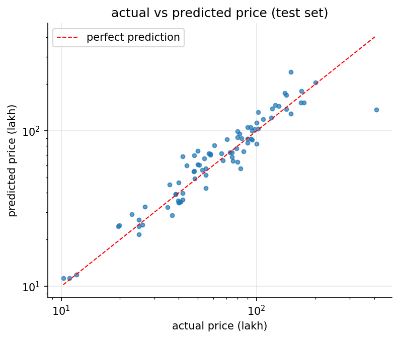

# assignment 2, house price prediction (bengaluru)

Linear Regression on the kaggle [Bengaluru House price data](https://www.kaggle.com/datasets/amitabhajoy/bengaluru-house-price-data),
on my personalised subset: **locations starting with "A"** (568 listings). the second rule, bathrooms >= 9 (last digit of
my roll number), left only 1 row, so as the handout says it was dropped.

**test R² 0.897** (train 0.873, 5-fold cross-validation 0.855 ± 0.026). the pass condition was 0.75.

## in plain words

1. **The task:** predict the price of a flat in Bengaluru from its size, number of bedrooms (BHK), bathrooms and location, using Linear Regression.
2. **My slice of the data:** the class rule is that every student works on a different subset. Mine is every location starting with "A" (for Anshuman): 568 listings across 85 locations.
3. **Cleaning:** some areas were written as ranges ("2100-2850"), so I took the middle. Three were in land units like acres, which are plots, not flats, so they went. Missing and repeated rows went too, leaving 536.
4. **Prices are lopsided:** most flats cost under ₹1.5 crore, but a few cost up to ₹29 crore. Taking the logarithm of the price squashes that long tail into a bell shape that a straight-line model handles much better.
5. **What drives price:** area matters most (correlation 0.71). Bedrooms and bathrooms go almost hand in hand (0.89) and add little once area is known. Location changes price over 5 times between the cheapest and costliest "A" areas.
6. **The first model was bad:** the plain model explained only 40% of the price differences on flats it hadn't seen (test R² 0.40), and on other splits it did even worse.
7. **Step by step it got better:** log of price, removing impossible listings (under 300 sq ft per bedroom), dropping listings priced way off their own neighbourhood, grouping rare locations, and log of area.
8. **The final model:** test R² 0.897, so it explains about 90% of the price differences on flats it never saw. The pass mark was 0.75.
9. **Not overfitting:** the training R² is 0.873, almost the same as the test score, and 5 different splits average 0.855, so it isn't memorising.
10. **What it learned:** a 10% bigger flat costs about 11.5% more. Once size is known, an extra bedroom barely changes the price. Location moves it from about 37% below to 92% above the baseline area.
11. **Limitations:** the outlier steps dropped 125 listings, so the model is meant for typical flats, not mansions or bargains. Its typical error is about ₹14 lakh.
12. **What gets handed in:** the notebook, the 1-page summary PDF, and the full report (PDF and Word) with every step's explanation, code and output screenshot.

## whats in here

| file | what it is |
|---|---|
| `house_price_bengaluru.ipynb` | **deliverable 1:** the notebook, executed, with all outputs |
| `Assignment-2-Summary.pdf` | **deliverable 2:** the 1-page summary report |
| `Assignment-2-House-Price-Bengaluru-Report.docx` | the doc file of code and output the handout asks for (every step: explanation -> code -> output screenshot) |
| `Assignment-2-House-Price-Bengaluru-Report.pdf` | the same report as a PDF |
| `figures/` | the 6 plots: price distribution, price by BHK, area vs price, correlation heatmap, price by location, actual vs predicted |
| `screenshots/` | one screenshot per code output |
| `report/` | `build_report.py`, `summary.md` (source of the 1-page summary), the pdf styles and the word template |
| `BRIEF.md` + `handout.pdf` | the assignment as posted on Classroom |
| `data/` | the kaggle csv, downloaded locally and gitignored |

## the iterations

| step | rows | test R² | 5-fold CV R² |
|---|---|---|---|
| v1 cleaned data, price as is | 536 | 0.403 | -1.887 |
| v2 + log of price | 536 | 0.787 | 0.702 |
| v3 + sanity rules (>= 300 sq ft per BHK, bathrooms <= BHK + 2) | 514 | 0.578 | 0.691 |
| v4 + price per sqft band per location | 411 | 0.849 | 0.801 |
| v5 + rare locations -> "other" | 411 | 0.885 | 0.813 |
| **v6 + log of area (final)** | 411 | **0.897** | **0.855 ± 0.026** |



## how to run it

```bash
cd "Machine Learning/Google Classroom/Assignment 2 - House Price Prediction (Bengaluru)"
kaggle datasets download -d amitabhajoy/bengaluru-house-price-data -p data --unzip
pip install pandas numpy matplotlib scikit-learn nbconvert ipykernel
jupyter nbconvert --to notebook --execute --inplace house_price_bengaluru.ipynb
python report/build_report.py    # needs pandoc + weasyprint (brew) and playwright's chromium
```
