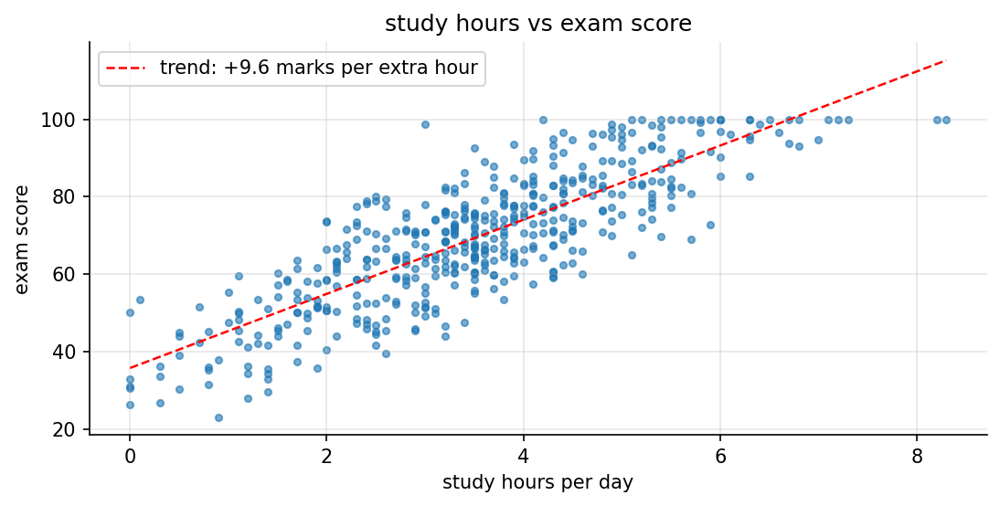

# assignment 4, student exam score prediction (study habits)

Linear Regression on the kaggle [Student Habits vs Academic Performance](https://www.kaggle.com/datasets/jayaantanaath/student-habits-vs-academic-performance)
dataset, on my personalised subset: **male students** (477). the second rule, study hours >= 5 (roll number mod 5, plus 1),
left only 80 students, so as the handout says it was dropped. the same task is also posted on Lisa as `Assignment-4`.

**test R² 0.916** (train 0.905, 5-fold cross-validation 0.898 ± 0.012). the pass condition was 0.70.

## in plain words

1. **The task:** predict a student's exam score (out of 100) from their daily habits, like study hours, sleep and social media, using Linear Regression.
2. **My slice of the data:** the handout filters by my own gender (male) and by study hours of at least 5 a day. That second rule left only 80 students, under the 150 minimum, so it was dropped, leaving 477 male students.
3. **Cleaning:** the data was already tidy. 37 students had no parental education listed, so they got an honest "Unknown" instead of a guess.
4. **The scores:** most students land between 55 and 85, the middle is 70, and 22 students hit a perfect 100.
5. **Study time is the big one:** every extra hour of study a day goes with about 9.6 more marks, and study hours alone explain about 70% of the differences in scores.
6. **Sleep matters too:** students who sleep 7 to 8 hours average 74, while those under 5 hours average 65.
7. **Part-time jobs cost a little:** about 2 marks lower on average, a smaller effect than you'd expect.
8. **Why more habits helped so much:** the habits barely move together, so each one adds new information. Going from 4 habits to all 7 took the score from 75% to 92%.
9. **The final score:** test R² 0.916 on students the model never saw (the pass mark was 0.70). Training R² is 0.905, and 5 different splits average 0.898, so it isn't memorising.
10. **What it learned:** per hour, study adds about 9.6 marks, while social media and Netflix take away about 2.3 and 2.2. Mental health adds about 2 marks per rating point.
11. **Limitations:** the typical error is about 4 marks, and scores can't go above 100, so the very best students are a little harder to predict.
12. **What gets handed in:** the notebook, the 1-page summary PDF, and the full report (PDF and Word) with every step's explanation, code and output screenshot.

## whats in here

| file | what it is |
|---|---|
| `exam_score_study_habits.ipynb` | **deliverable 1:** the notebook, executed, with all outputs |
| `Assignment-4-Summary.pdf` | **deliverable 2:** the 1-page summary report |
| `Assignment-4-Exam-Score-Study-Habits-Report.docx` | the doc file of code and output (every step: explanation -> code -> output screenshot) |
| `Assignment-4-Exam-Score-Study-Habits-Report.pdf` | the same report as a PDF |
| `figures/` | the 6 plots: score distribution, study hours vs score, score by part-time job, correlation heatmap, score by sleep, actual vs predicted |
| `screenshots/` | one screenshot per code output |
| `report/` | `build_report.py`, `summary.md` (source of the 1-page summary), the pdf styles and the word template |
| `BRIEF.md` + `handout.pdf` | the assignment as posted on Classroom |
| `data/` | the kaggle csv, downloaded locally and gitignored |

## the versions

| version | features | test R² | 5-fold CV R² |
|---|---|---|---|
| v1 study hours only | 1 | 0.710 | 0.658 |
| v2 + sleep, attendance, social media | 4 | 0.752 | 0.713 |
| v3 + all daily habits | 8 | 0.916 | 0.897 |
| v4 + text columns, encoded (no gain) | 17 | 0.913 | 0.896 |
| **v5 weak features dropped (final)** | 7 | **0.916** | **0.898 ± 0.012** |
| v6 same as v5, scaled (same R², as expected for linear regression) | 7 | 0.916 | 0.898 |



## how to run it

```bash
cd "Machine Learning/Google Classroom/Assignment 4 - Student Exam Score Prediction (Study Habits)"
kaggle datasets download -d jayaantanaath/student-habits-vs-academic-performance -p data --unzip
pip install pandas numpy matplotlib scikit-learn nbconvert ipykernel
jupyter nbconvert --to notebook --execute --inplace exam_score_study_habits.ipynb
python report/build_report.py    # needs pandoc + weasyprint (brew) and playwright's chromium
```
