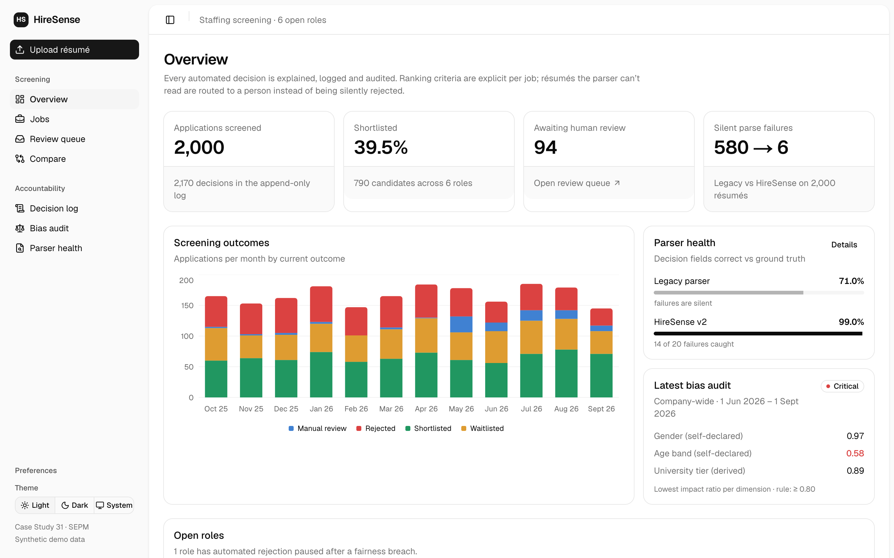
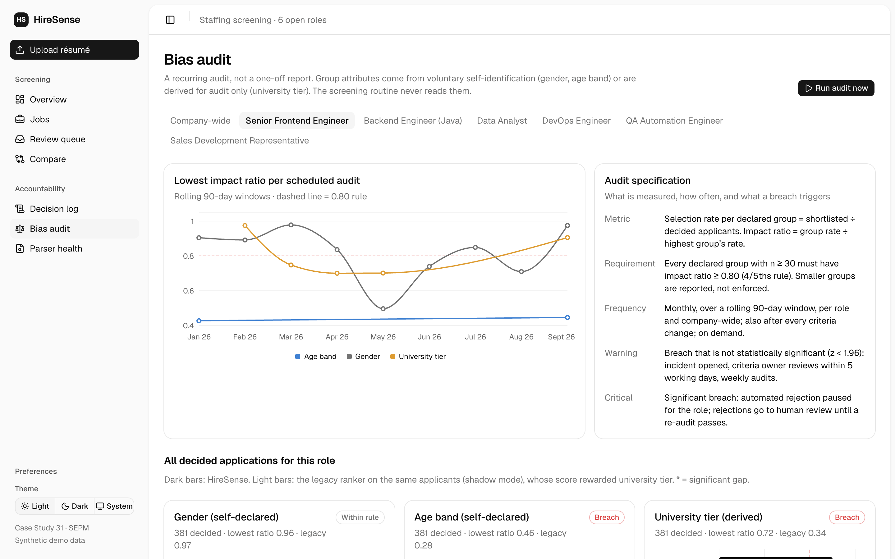
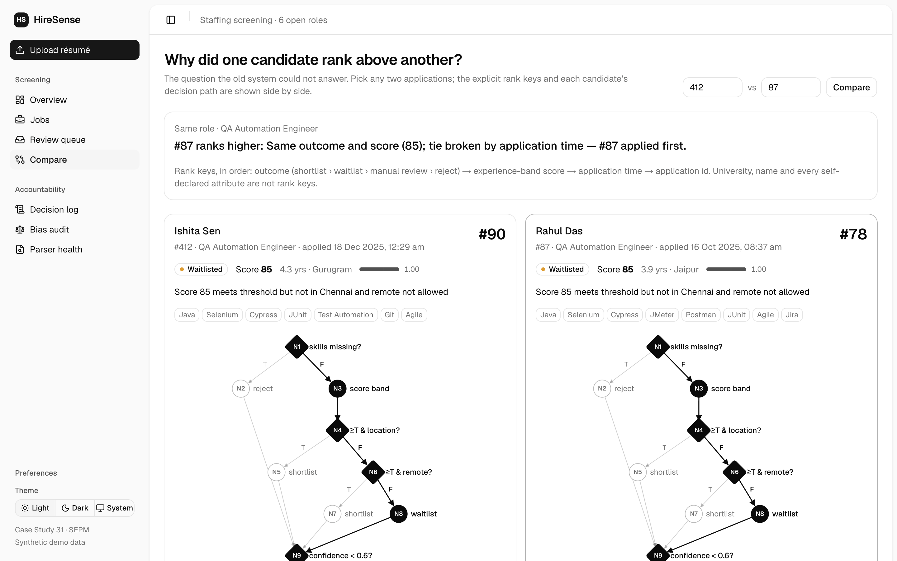
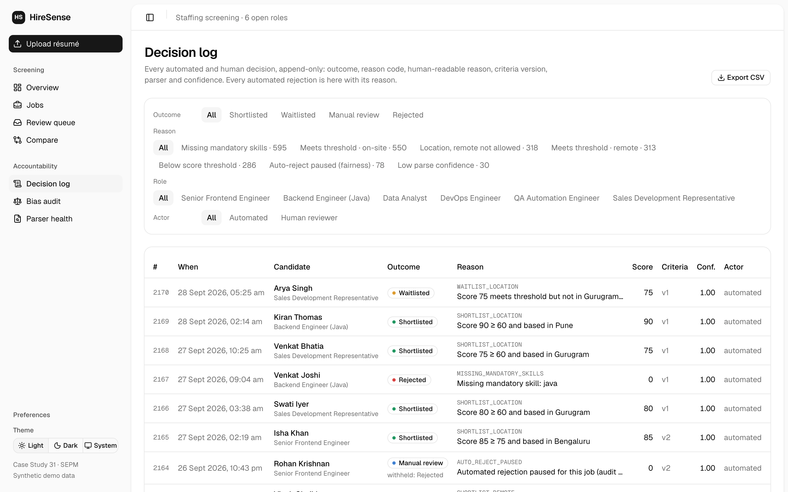
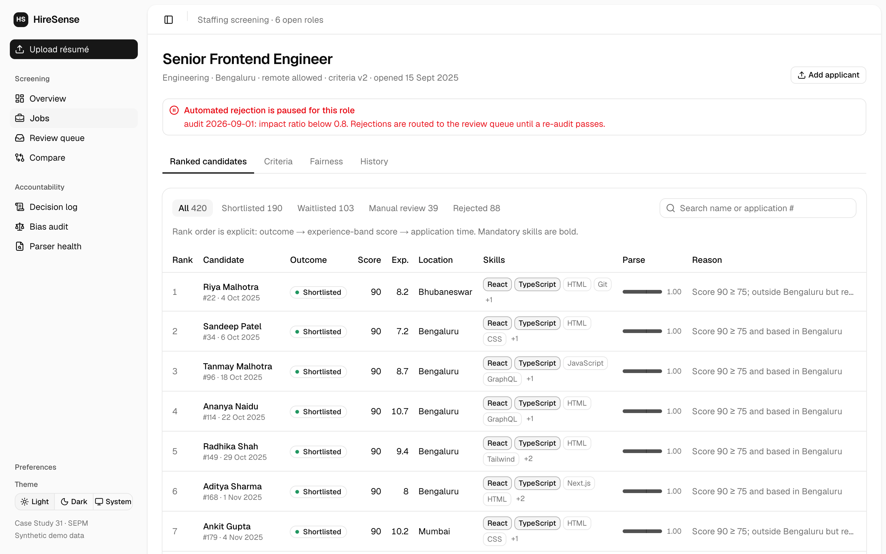
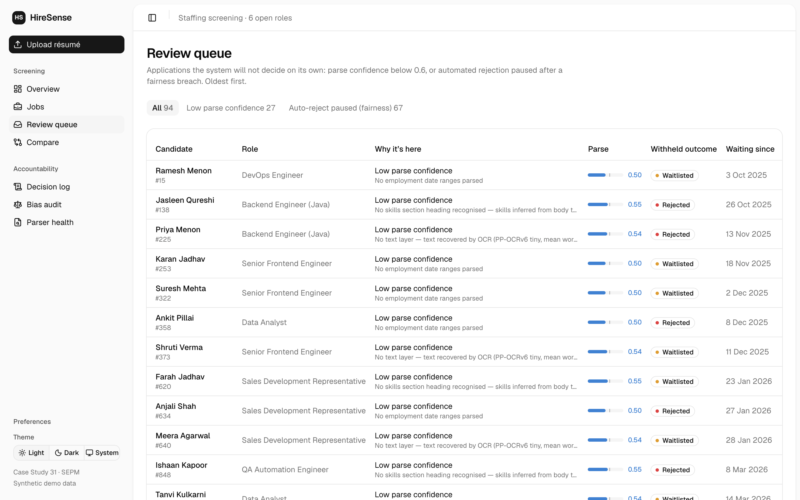
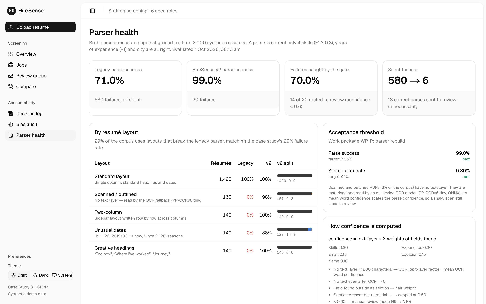
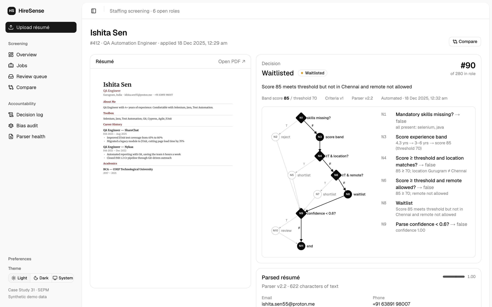

# HireSense — SE&PM Major Project (Case Study 31)

an explainable applicant tracking system, built for SEPM Case Study 31: *"an ATS with a bias-audit
requirement."* this folder is the full submission, the working code, the formal deliverables, and
screenshots of it running.

> this is the **major / exam project** (Case Study 31). the mini project is a separate thing
> (EmpowerHR), in its own folder.

## the problem, and what HireSense does about it

the legacy screener had three real defects: a ranking nobody could explain, a ranking that secretly
tracked **university tier**, and a résumé parser that failed **silently on 29%** of documents (it
just dropped them). HireSense replaces it and makes every decision defensible:

- **explicit, versioned criteria per job** (mandatory skills, experience bands, threshold, location, remote flag).
- **the case study's screening routine implemented exactly as written** — every decision stores its path through the control-flow graph (nodes N1…N11).
- **a parse-confidence gate**: a résumé the parser isn't sure about (< 0.6) goes to a human instead of being silently rejected.
- **an append-only decision log** — every automated rejection is logged with a reason, and SQLite triggers physically refuse UPDATE and DELETE.
- **a recurring bias audit** on the 4/5ths rule: if any group's selection rate drops below 80% of the top group's, a breach **pauses automated rejection** for that role.
- **shadow mode**: the old parser and ranker run on the same résumés, so the improvement is *measured*, not claimed.

all candidates and résumés are **synthetic**, generated deterministically by the seed.

## what the numbers say (2,000 synthetic résumés)

| | legacy | HireSense v2 |
|---|---|---|
| correct decision fields | 71.0% | **99.0%** |
| silent parse failures | 580 | **6** (0.3%) |
| scanned résumés read (OCR) | 0 / 160 | **157 / 160** |

the v2 audit also catches a genuine proxy effect: experience bands disadvantage the 18–29 age band
on senior roles, so auto-rejection pauses for Senior Frontend Engineer. tier is ignored entirely,
and a metamorphic test proves changing a candidate's university never changes a decision.

## screenshots

| | |
|---|---|
|  **Overview** — KPIs, screening outcomes, parser health, live bias audit |  **Bias audit** — 4/5ths rule per protected group, breaches flagged |
|  **Compare** — legacy vs HireSense, shadow mode |  **Decision log** — append-only, every rejection with a reason |
|  **Job criteria** — versioned mandatory skills, bands, threshold |  **Review queue** — low-confidence parses routed to a human |
|  **Parser health** — 71% legacy vs 99% v2, silent-failure tracking |  **Application** — one candidate, parsed fields + confidence |

(`screenshots/criteria.png` has the full criteria editor too.)

## what's in this folder

```
Case Study 31 - HireSense ATS/
├── README.md        <- you are here
├── hiresense/       <- the working code (see hiresense/README.md to run it)
│   ├── web/         Next.js 16 · React 19 · Tailwind · recharts
│   ├── api/         Bun · Hono · bun:sqlite · OCR (PP-OCRv6)
│   └── ...          82 tests with coverage, white-box + boundary + metamorphic
├── deliverables/    <- the formal docs (PDF)
│   ├── D0-Submission-Index.pdf
│   ├── D1-White-Box-Test-Report.pdf        (CFG, V(G)=5, the 5 basis paths)
│   ├── D2-Software-Requirements-Specification.pdf
│   ├── D3-Design-Pack.pdf
│   ├── D4-Audit-Specification.pdf
│   ├── D5-Project-Plan.pdf
│   ├── D6-Maintenance-Process.pdf
│   └── HireSense-Case-Study-31-All-Deliverables.pdf   (everything in one)
└── screenshots/     <- the images above
```

## running it

needs [Bun](https://bun.sh) ≥ 1.3. full detail in `hiresense/README.md`:

```bash
cd hiresense
bun run setup      # install + seed 2,000 synthetic applications
bun run dev        # API on :8787, web on :3000
bun run test       # 82 tests with coverage
```
